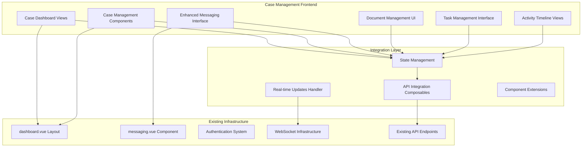

# Case Management System Design Document

## Overview

The Case Management System provides comprehensive frontend interfaces that integrate with existing API endpoints to deliver intuitive case lifecycle management for lawyers and clients. Building upon the established Nuxt.js application with existing dashboard.vue layout, authentication system, and messaging.vue component, this system creates seamless user experiences for case management, client-lawyer communication, document management, and task tracking.

### Key Design Principles

- **Seamless Integration**: Leverages existing dashboard layout, authentication, and messaging components
- **API-First Approach**: Consumes existing backend API endpoints without modification
- **Component Reusability**: Extends existing UI components and design patterns
- **Real-time Experience**: Integrates with existing WebSocket infrastructure for live updates
- **Role-based Interface**: Provides tailored experiences for clients and lawyers
- **Mobile-First Design**: Responsive interfaces that work across all devices

### System Boundaries

The Case Management System frontend integrates with:
- Existing Nuxt.js frontend application and dashboard.vue layout
- Current authentication system and user session management
- Established messaging.vue component for real-time communication
- Existing API endpoints for all case management functionality
- Current WebSocket infrastructure for real-time updates
- Existing design system and UI component library

## Architecture

### Frontend Architecture Overview



### Component Architecture

The system extends existing components and creates new specialized interfaces:

1. **Dashboard Integration**: Extends dashboard.vue with case management navigation and views
2. **Messaging Enhancement**: Builds upon messaging.vue for case-specific conversations
3. **API Integration**: Creates composables that consume existing API endpoints
4. **State Management**: Implements Nuxt/Vue state management for case data
5. **Real-time Integration**: Leverages existing WebSocket infrastructure for live updates

### Technology Stack

- **Frontend Framework**: Nuxt.js 3 (existing)
- **UI Framework**: Vue 3 with Composition API (existing)
- **UI Components**: Nuxt UI component library (existing)
- **Styling**: TailwindCSS with existing design system
- **State Management**: Vue composables and Pinia (if needed)
- **Real-time**: Existing WebSocket infrastructure
- **API Integration**: Existing API endpoints
- **Authentication**: Existing authentication system

## Components and Interfaces

### Core Frontend Components

#### 1. Dashboard Integration Components

**CaseDashboard.vue**: Main case management dashboard that extends existing dashboard layout
- Integrates with dashboard.vue layout
- Provides case overview and navigation
- Displays case statistics and recent activities
- Implements role-based view switching

**CaseList.vue**: Comprehensive case listing with filtering and search
- Consumes case list API endpoints
- Implements pagination and infinite scroll
- Provides advanced filtering options
- Supports bulk operations for lawyers

**CaseCard.vue**: Individual case summary display component
- Shows case status, priority, and key information
- Provides quick action buttons
- Displays recent activity indicators
- Implements responsive design

#### 2. Enhanced Messaging Components

**CaseMessaging.vue**: Enhanced messaging interface extending messaging.vue
- Extends existing messaging.vue component
- Adds case-specific conversation context
- Integrates with existing WebSocket infrastructure
- Provides file attachment capabilities

**MessageThread.vue**: Case-specific message thread display
- Shows conversation history from pre-consultation through case management
- Implements message search within conversations
- Displays message read/unread status
- Supports message reactions and threading

#### 3. Document Management Components

**DocumentManager.vue**: Comprehensive document management interface
- Provides drag-and-drop file upload
- Implements folder-based organization
- Shows upload progress and validation feedback
- Integrates with existing file storage APIs

**DocumentList.vue**: Document listing with organization features
- Displays documents with metadata
- Provides sorting and filtering options
- Shows document access permissions
- Implements document preview functionality

**DocumentViewer.vue**: Secure document preview and download
- Provides in-browser document preview
- Implements secure download functionality
- Shows document version history
- Supports document sharing controls

#### 4. Task Management Components

**TaskManager.vue**: Task creation and management interface
- Allows lawyers to create and assign tasks
- Provides task templates and quick actions
- Implements due date and priority management
- Shows task completion statistics

**TaskList.vue**: Task listing for clients and lawyers
- Displays tasks with status indicators
- Provides filtering by status, priority, and due date
- Implements task search functionality
- Shows task assignment and completion history

**TaskCard.vue**: Individual task display and interaction
- Shows task details and status
- Provides completion actions for clients
- Displays task comments and updates
- Implements overdue task highlighting

#### 5. Activity Timeline Components

**ActivityTimeline.vue**: Comprehensive case activity display
- Shows chronological case activities
- Provides activity filtering and search
- Implements infinite scroll for large datasets
- Displays activity statistics and summaries

**ActivityCard.vue**: Individual activity display component
- Shows activity details with appropriate icons
- Displays user information and timestamps
- Provides expandable activity details
- Implements activity type categorization

### API Integration Layer

#### 1. Case Management Composables

**useCases.ts**: Case data management composable
```typescript
export const useCases = () => {
  const cases = ref<Case[]>([])
  const loading = ref(false)
  const error = ref<string | null>(null)
  
  const fetchCases = async (filters?: CaseFilters) => {
    loading.value = true
    try {
      const response = await $fetch('/api/cases', { query: filters })
      cases.value = response.cases
    } catch (err) {
      error.value = 'Failed to fetch cases'
    } finally {
      loading.value = false
    }
  }
  
  const updateCaseStatus = async (caseId: string, status: CaseStatus) => {
    try {
      const updatedCase = await $fetch(`/api/cases/${caseId}/status`, {
        method: 'PATCH',
        body: { status }
      })
      // Update local state
      const index = cases.value.findIndex(c => c.id === caseId)
      if (index !== -1) {
        cases.value[index] = updatedCase
      }
      return updatedCase
    } catch (err) {
      throw new Error('Failed to update case status')
    }
  }
  
  return {
    cases: readonly(cases),
    loading: readonly(loading),
    error: readonly(error),
    fetchCases,
    updateCaseStatus
  }
}
```

#### 2. Document Management Composables

**useDocuments.ts**: Document operations composable
```typescript
export const useDocuments = () => {
  const documents = ref<Document[]>([])
  const uploading = ref(false)
  const uploadProgress = ref(0)
  
  const uploadDocument = async (caseId: string, file: File) => {
    uploading.value = true
    uploadProgress.value = 0
    
    const formData = new FormData()
    formData.append('file', file)
    
    try {
      const response = await $fetch(`/api/cases/${caseId}/documents`, {
        method: 'POST',
        body: formData,
        onUploadProgress: (progress) => {
          uploadProgress.value = Math.round((progress.loaded / progress.total) * 100)
        }
      })
      
      documents.value.push(response)
      return response
    } catch (err) {
      throw new Error('Failed to upload document')
    } finally {
      uploading.value = false
      uploadProgress.value = 0
    }
  }
  
  return {
    documents: readonly(documents),
    uploading: readonly(uploading),
    uploadProgress: readonly(uploadProgress),
    uploadDocument
  }
}
```

#### 3. Task Management Composables

**useTasks.ts**: Task operations composable
```typescript
export const useTasks = () => {
  const tasks = ref<Task[]>([])
  const loading = ref(false)
  
  const createTask = async (caseId: string, taskData: CreateTaskRequest) => {
    try {
      const newTask = await $fetch(`/api/cases/${caseId}/tasks`, {
        method: 'POST',
        body: taskData
      })
      tasks.value.push(newTask)
      return newTask
    } catch (err) {
      throw new Error('Failed to create task')
    }
  }
  
  const updateTaskStatus = async (taskId: string, status: TaskStatus) => {
    try {
      const updatedTask = await $fetch(`/api/tasks/${taskId}`, {
        method: 'PATCH',
        body: { status }
      })
      
      const index = tasks.value.findIndex(t => t.id === taskId)
      if (index !== -1) {
        tasks.value[index] = updatedTask
      }
      return updatedTask
    } catch (err) {
      throw new Error('Failed to update task status')
    }
  }
  
  return {
    tasks: readonly(tasks),
    loading: readonly(loading),
    createTask,
    updateTaskStatus
  }
}
```

#### 4. Real-time Integration Composables

**useRealTimeUpdates.ts**: WebSocket integration composable
```typescript
export const useRealTimeUpdates = (caseId: string) => {
  const { $socket } = useNuxtApp()
  
  onMounted(() => {
    // Join case room for real-time updates
    $socket.emit('case:join', caseId)
    
    // Listen for case updates
    $socket.on('case:status_changed', handleCaseStatusChange)
    $socket.on('task:created', handleTaskCreated)
    $socket.on('task:updated', handleTaskUpdated)
    $socket.on('document:uploaded', handleDocumentUploaded)
    $socket.on('activity:new', handleNewActivity)
  })
  
  onUnmounted(() => {
    // Leave case room
    $socket.emit('case:leave', caseId)
    
    // Remove listeners
    $socket.off('case:status_changed', handleCaseStatusChange)
    $socket.off('task:created', handleTaskCreated)
    $socket.off('task:updated', handleTaskUpdated)
    $socket.off('document:uploaded', handleDocumentUploaded)
    $socket.off('activity:new', handleNewActivity)
  })
  
  const handleCaseStatusChange = (data: { caseId: string, status: CaseStatus }) => {
    // Update local case state
    const { updateLocalCaseStatus } = useCases()
    updateLocalCaseStatus(data.caseId, data.status)
  }
  
  // Additional handlers...
}
```

## Data Models and State Management

### Frontend Data Models

#### TypeScript Interfaces for API Integration

```typescript
// Core Case Interface
interface Case {
  id: string
  caseNumber: string
  bookingId?: string
  clientId: string
  lawyerId: string
  title: string
  description?: string
  status: CaseStatus
  priority: Priority
  dueDate?: Date
  hourlyRate?: number
  totalBilled: number
  createdAt: Date
  updatedAt: Date
  closedAt?: Date
  archivedAt?: Date
  
  // Relations (populated by API)
  client?: User
  lawyer?: User
  conversation?: Conversation
  documents?: Document[]
  tasks?: Task[]
  activities?: Activity[]
  
  // UI-specific computed properties
  isOverdue?: boolean
  unreadMessageCount?: number
  completedTaskCount?: number
  totalTaskCount?: number
}

type CaseStatus = 'active' | 'closed' | 'reopened' | 'archived'
type Priority = 'low' | 'medium' | 'high' | 'urgent'

// Document Interface
interface Document {
  id: string
  caseId: string
  uploadedBy: string
  fileName: string
  fileType: string
  fileSize: number
  fileUrl: string
  folderPath?: string
  isClientAccessible: boolean
  downloadCount: number
  createdAt: Date
  updatedAt: Date
  
  // Relations
  uploader?: User
  
  // UI-specific properties
  isUploading?: boolean
  uploadProgress?: number
  previewUrl?: string
}

// Task Interface
interface Task {
  id: string
  caseId: string
  assignedTo: string
  createdBy: string
  title: string
  description?: string
  status: TaskStatus
  priority: Priority
  dueDate?: Date
  completedAt?: Date
  createdAt: Date
  updatedAt: Date
  
  // Relations
  assignee?: User
  creator?: User
  
  // UI-specific properties
  isOverdue?: boolean
  daysUntilDue?: number
}

type TaskStatus = 'pending' | 'in_progress' | 'completed' | 'overdue'

// Activity Interface
interface Activity {
  id: string
  caseId: string
  userId: string
  activityType: ActivityType
  title: string
  description?: string
  metadata?: Record<string, any>
  createdAt: Date
  
  // Relations
  user?: User
  
  // UI-specific properties
  icon?: string
  color?: string
  isRecent?: boolean
}

type ActivityType = 
  | 'case_created' 
  | 'status_changed' 
  | 'message_sent' 
  | 'document_uploaded'
  | 'task_created' 
  | 'task_completed' 
  | 'case_closed' 
  | 'case_reopened'
```

### State Management Architecture

#### 1. Composable-Based State Management

The system uses Vue 3 Composition API with composables for state management:

```typescript
// Global case management state
export const useCaseManagementStore = () => {
  // Reactive state
  const cases = ref<Case[]>([])
  const currentCase = ref<Case | null>(null)
  const loading = ref(false)
  const error = ref<string | null>(null)
  
  // Computed properties
  const activeCases = computed(() => 
    cases.value.filter(c => c.status === 'active')
  )
  
  const overdueCases = computed(() =>
    cases.value.filter(c => c.isOverdue)
  )
  
  const casesByStatus = computed(() => {
    return cases.value.reduce((acc, case_) => {
      if (!acc[case_.status]) acc[case_.status] = []
      acc[case_.status].push(case_)
      return acc
    }, {} as Record<CaseStatus, Case[]>)
  })
  
  // Actions
  const fetchCases = async (filters?: CaseFilters) => {
    loading.value = true
    error.value = null
    
    try {
      const response = await $fetch('/api/cases', { query: filters })
      cases.value = response.cases.map(enrichCaseData)
    } catch (err) {
      error.value = 'Failed to fetch cases'
      console.error('Case fetch error:', err)
    } finally {
      loading.value = false
    }
  }
  
  const setCurrentCase = (case_: Case) => {
    currentCase.value = case_
  }
  
  const updateCaseInList = (updatedCase: Case) => {
    const index = cases.value.findIndex(c => c.id === updatedCase.id)
    if (index !== -1) {
      cases.value[index] = enrichCaseData(updatedCase)
    }
  }
  
  // Helper function to enrich case data with computed properties
  const enrichCaseData = (case_: Case): Case => {
    return {
      ...case_,
      isOverdue: case_.dueDate ? new Date(case_.dueDate) < new Date() : false,
      unreadMessageCount: 0, // Will be populated by messaging composable
      completedTaskCount: case_.tasks?.filter(t => t.status === 'completed').length || 0,
      totalTaskCount: case_.tasks?.length || 0
    }
  }
  
  return {
    // State
    cases: readonly(cases),
    currentCase: readonly(currentCase),
    loading: readonly(loading),
    error: readonly(error),
    
    // Computed
    activeCases,
    overdueCases,
    casesByStatus,
    
    // Actions
    fetchCases,
    setCurrentCase,
    updateCaseInList
  }
}
```

#### 2. Local Component State

Components maintain local state for UI-specific concerns:

```typescript
// Example: CaseList.vue local state
export default defineComponent({
  setup() {
    // Local UI state
    const searchQuery = ref('')
    const selectedFilters = ref<CaseFilters>({})
    const sortBy = ref<'createdAt' | 'updatedAt' | 'dueDate'>('updatedAt')
    const sortOrder = ref<'asc' | 'desc'>('desc')
    const selectedCases = ref<string[]>([])
    
    // Global state
    const { cases, loading, fetchCases } = useCaseManagementStore()
    
    // Computed filtered cases
    const filteredCases = computed(() => {
      let filtered = cases.value
      
      // Apply search
      if (searchQuery.value) {
        const query = searchQuery.value.toLowerCase()
        filtered = filtered.filter(c => 
          c.title.toLowerCase().includes(query) ||
          c.caseNumber.toLowerCase().includes(query) ||
          c.client?.name.toLowerCase().includes(query)
        )
      }
      
      // Apply filters
      if (selectedFilters.value.status) {
        filtered = filtered.filter(c => c.status === selectedFilters.value.status)
      }
      
      if (selectedFilters.value.priority) {
        filtered = filtered.filter(c => c.priority === selectedFilters.value.priority)
      }
      
      // Apply sorting
      filtered.sort((a, b) => {
        const aValue = a[sortBy.value]
        const bValue = b[sortBy.value]
        
        if (sortOrder.value === 'asc') {
          return aValue > bValue ? 1 : -1
        } else {
          return aValue < bValue ? 1 : -1
        }
      })
      
      return filtered
    })
    
    return {
      searchQuery,
      selectedFilters,
      sortBy,
      sortOrder,
      selectedCases,
      filteredCases,
      loading,
      fetchCases
    }
  }
})
```

### API Response Caching

#### 1. Request Caching Strategy

```typescript
// API caching composable
export const useApiCache = () => {
  const cache = new Map<string, { data: any, timestamp: number, ttl: number }>()
  
  const getCachedData = <T>(key: string): T | null => {
    const cached = cache.get(key)
    if (!cached) return null
    
    const now = Date.now()
    if (now - cached.timestamp > cached.ttl) {
      cache.delete(key)
      return null
    }
    
    return cached.data as T
  }
  
  const setCachedData = <T>(key: string, data: T, ttl: number = 5 * 60 * 1000) => {
    cache.set(key, {
      data,
      timestamp: Date.now(),
      ttl
    })
  }
  
  const invalidateCache = (pattern?: string) => {
    if (!pattern) {
      cache.clear()
      return
    }
    
    const regex = new RegExp(pattern)
    for (const key of cache.keys()) {
      if (regex.test(key)) {
        cache.delete(key)
      }
    }
  }
  
  return {
    getCachedData,
    setCachedData,
    invalidateCache
  }
}

// Usage in API composables
export const useCasesWithCache = () => {
  const { getCachedData, setCachedData, invalidateCache } = useApiCache()
  
  const fetchCases = async (filters?: CaseFilters) => {
    const cacheKey = `cases:${JSON.stringify(filters || {})}`
    
    // Try cache first
    const cached = getCachedData<{ cases: Case[], total: number }>(cacheKey)
    if (cached) {
      return cached
    }
    
    // Fetch from API
    const response = await $fetch('/api/cases', { query: filters })
    
    // Cache the response
    setCachedData(cacheKey, response, 5 * 60 * 1000) // 5 minutes
    
    return response
  }
  
  const invalidateCasesCache = () => {
    invalidateCache('cases:')
  }
  
  return {
    fetchCases,
    invalidateCasesCache
  }
}
```

## API Integration Design

### Existing API Endpoints Integration

The frontend integrates with existing API endpoints without requiring backend modifications:

#### Case Management API Integration
```typescript
// API endpoint consumption patterns
const caseApiEndpoints = {
  // Get cases for current user (role-based filtering handled by API)
  getCases: (filters?: CaseFilters) => 
    $fetch('/api/cases', { query: filters }),
  
  // Get specific case details with relations
  getCaseById: (id: string) => 
    $fetch(`/api/cases/${id}`),
  
  // Create case from booking (lawyer only)
  createFromBooking: (bookingId: string) => 
    $fetch(`/api/cases/from-booking/${bookingId}`, { method: 'POST' }),
  
  // Update case status (lawyer only)
  updateCaseStatus: (id: string, status: CaseStatus) => 
    $fetch(`/api/cases/${id}/status`, { 
      method: 'PATCH', 
      body: { status } 
    }),
  
  // Update case details (lawyer only)
  updateCase: (id: string, updates: Partial<Case>) => 
    $fetch(`/api/cases/${id}`, { 
      method: 'PATCH', 
      body: updates 
    })
}

// Document API integration
const documentApiEndpoints = {
  // Upload document to case
  uploadDocument: (caseId: string, file: File) => {
    const formData = new FormData()
    formData.append('file', file)
    return $fetch(`/api/cases/${caseId}/documents`, {
      method: 'POST',
      body: formData
    })
  },
  
  // Get case documents
  getCaseDocuments: (caseId: string) => 
    $fetch(`/api/cases/${caseId}/documents`),
  
  // Get secure download URL
  getDownloadUrl: (documentId: string) => 
    $fetch(`/api/documents/${documentId}/download`),
  
  // Delete document (access control handled by API)
  deleteDocument: (documentId: string) => 
    $fetch(`/api/documents/${documentId}`, { method: 'DELETE' })
}

// Task API integration
const taskApiEndpoints = {
  // Create task (lawyer only)
  createTask: (caseId: string, taskData: CreateTaskRequest) => 
    $fetch(`/api/cases/${caseId}/tasks`, {
      method: 'POST',
      body: taskData
    }),
  
  // Get case tasks
  getCaseTasks: (caseId: string) => 
    $fetch(`/api/cases/${caseId}/tasks`),
  
  // Update task status
  updateTaskStatus: (taskId: string, status: TaskStatus) => 
    $fetch(`/api/tasks/${taskId}`, {
      method: 'PATCH',
      body: { status }
    }),
  
  // Get user tasks (role-based filtering by API)
  getUserTasks: (filters?: TaskFilters) => 
    $fetch('/api/tasks/my-tasks', { query: filters })
}

// Activity API integration
const activityApiEndpoints = {
  // Get case activity timeline
  getCaseActivities: (caseId: string, filters?: ActivityFilters) => 
    $fetch(`/api/cases/${caseId}/activities`, { query: filters }),
  
  // Get activity statistics
  getActivityStats: (caseId: string) => 
    $fetch(`/api/cases/${caseId}/activities/stats`)
}
```

### Error Handling Integration

#### Centralized Error Handling
```typescript
// Error handling composable
export const useApiErrorHandler = () => {
  const toast = useToast()
  const router = useRouter()
  
  const handleApiError = (error: any, context?: string) => {
    console.error(`API Error${context ? ` in ${context}` : ''}:`, error)
    
    // Handle different error types
    if (error.status === 401) {
      toast.add({
        title: 'Authentication Required',
        description: 'Please log in to continue',
        color: 'red'
      })
      router.push('/auth/login')
      return
    }
    
    if (error.status === 403) {
      toast.add({
        title: 'Access Denied',
        description: 'You do not have permission to perform this action',
        color: 'red'
      })
      return
    }
    
    if (error.status === 404) {
      toast.add({
        title: 'Not Found',
        description: 'The requested resource was not found',
        color: 'red'
      })
      return
    }
    
    // Handle specific error codes from API
    const errorCode = error.data?.error?.code
    switch (errorCode) {
      case 'CASE_NOT_FOUND':
        toast.add({
          title: 'Case Not Found',
          description: 'The requested case could not be found',
          color: 'red'
        })
        router.push('/dashboard/cases')
        break
        
      case 'FILE_TOO_LARGE':
        toast.add({
          title: 'File Too Large',
          description: 'File size exceeds the 25MB limit',
          color: 'red'
        })
        break
        
      case 'UNSUPPORTED_FILE_TYPE':
        toast.add({
          title: 'Unsupported File Type',
          description: 'Please upload a supported file format',
          color: 'red'
        })
        break
        
      default:
        toast.add({
          title: 'Error',
          description: error.data?.error?.message || 'An unexpected error occurred',
          color: 'red'
        })
    }
  }
  
  return { handleApiError }
}

// Usage in composables
export const useCasesWithErrorHandling = () => {
  const { handleApiError } = useApiErrorHandler()
  const cases = ref<Case[]>([])
  const loading = ref(false)
  
  const fetchCases = async (filters?: CaseFilters) => {
    loading.value = true
    try {
      const response = await caseApiEndpoints.getCases(filters)
      cases.value = response.cases
    } catch (error) {
      handleApiError(error, 'fetchCases')
    } finally {
      loading.value = false
    }
  }
  
  return { cases, loading, fetchCases }
}
```

### Real-time Integration with Existing WebSocket

#### WebSocket Event Handling
```typescript
// Real-time updates integration
export const useCaseRealTimeUpdates = () => {
  const { $socket } = useNuxtApp()
  const { updateCaseInList } = useCaseManagementStore()
  const { addDocument } = useDocumentStore()
  const { updateTaskInList } = useTaskStore()
  const { addActivity } = useActivityStore()
  
  // WebSocket event handlers
  const setupRealTimeListeners = () => {
    // Case status changes
    $socket.on('case:status_changed', (data: {
      caseId: string
      status: CaseStatus
      changedBy: string
      timestamp: string
    }) => {
      // Update local case state
      const updatedCase = { ...getCurrentCase(data.caseId), status: data.status }
      updateCaseInList(updatedCase)
      
      // Show notification
      showNotification({
        title: 'Case Status Updated',
        message: `Case status changed to ${data.status}`,
        type: 'info'
      })
    })
    
    // New task created
    $socket.on('task:created', (data: { task: Task, caseId: string }) => {
      updateTaskInList(data.task)
      
      // Show notification if task is assigned to current user
      const { user } = useAuth()
      if (data.task.assignedTo === user.value?.id) {
        showNotification({
          title: 'New Task Assigned',
          message: `You have been assigned: ${data.task.title}`,
          type: 'info'
        })
      }
    })
    
    // Task status updated
    $socket.on('task:updated', (data: { task: Task, caseId: string }) => {
      updateTaskInList(data.task)
    })
    
    // Document uploaded
    $socket.on('document:uploaded', (data: { document: Document, caseId: string }) => {
      addDocument(data.document)
      
      showNotification({
        title: 'New Document',
        message: `${data.document.fileName} has been uploaded`,
        type: 'info'
      })
    })
    
    // New activity
    $socket.on('activity:new', (data: { activity: Activity, caseId: string }) => {
      addActivity(data.activity)
    })
  }
  
  const cleanupRealTimeListeners = () => {
    $socket.off('case:status_changed')
    $socket.off('task:created')
    $socket.off('task:updated')
    $socket.off('document:uploaded')
    $socket.off('activity:new')
  }
  
  // Join/leave case rooms
  const joinCaseRoom = (caseId: string) => {
    $socket.emit('case:join', caseId)
  }
  
  const leaveCaseRoom = (caseId: string) => {
    $socket.emit('case:leave', caseId)
  }
  
  return {
    setupRealTimeListeners,
    cleanupRealTimeListeners,
    joinCaseRoom,
    leaveCaseRoom
  }
}
```

## Security and Authorization

### Access Control Matrix

| Resource | Client (Own Cases) | Lawyer (Assigned Cases) | Admin |
|----------|-------------------|------------------------|-------|
| View Case | ✓ | ✓ | ✓ |
| Update Case | ✗ | ✓ | ✓ |
| Close Case | ✗ | ✓ | ✓ |
| Send Messages | ✓ | ✓ | ✓ |
| Upload Documents | ✓ | ✓ | ✓ |
| Delete Documents | Own only | ✓ | ✓ |
| Create Tasks | ✗ | ✓ | ✓ |
| Complete Tasks | Assigned only | ✓ | ✓ |
| View Activities | ✓ | ✓ | ✓ |

### Security Measures

1. **Authentication**: Integration with existing Better Auth system
2. **Authorization**: Role-based access control with case-specific permissions
3. **Data Encryption**: All sensitive data encrypted at rest and in transit
4. **File Security**: Virus scanning, type validation, secure storage
5. **Audit Logging**: Comprehensive activity tracking for compliance
6. **Session Management**: Secure session handling with timeout
7. **Rate Limiting**: API rate limiting to prevent abuse

## Performance Considerations

### Database Optimization

1. **Indexing Strategy**:
   ```sql
   -- Case lookups
   CREATE INDEX idx_cases_lawyer_status ON cases(lawyer_id, status);
   CREATE INDEX idx_cases_client_status ON cases(client_id, status);
   CREATE INDEX idx_cases_created_at ON cases(created_at DESC);
   
   -- Document lookups
   CREATE INDEX idx_documents_case_id ON case_documents(case_id);
   CREATE INDEX idx_documents_uploaded_by ON case_documents(uploaded_by);
   
   -- Task lookups
   CREATE INDEX idx_tasks_case_assigned ON case_tasks(case_id, assigned_to);
   CREATE INDEX idx_tasks_due_date ON case_tasks(due_date) WHERE status != 'completed';
   
   -- Activity lookups
   CREATE INDEX idx_activities_case_created ON case_activities(case_id, created_at DESC);
   ```

2. **Query Optimization**:
   - Use pagination for large datasets
   - Implement efficient joins with proper indexing
   - Cache frequently accessed data in Redis

### Caching Strategy

1. **Redis Caching**:
   - Case summaries (5-minute TTL)
   - User permissions (10-minute TTL)
   - Document metadata (1-hour TTL)
   - Activity counts (5-minute TTL)

2. **Application-Level Caching**:
   - Case status lookups
   - User role information
   - File type configurations

### Real-time Performance

1. **WebSocket Optimization**:
   - Room-based message routing
   - Connection pooling
   - Graceful degradation for offline users

2. **File Upload Optimization**:
   - Chunked uploads for large files
   - Progress tracking
   - Background processing for virus scanning

## Integration Points

### Booking System Integration

The case management system seamlessly integrates with the existing booking system:

1. **Engagement Outcome Processing**:
   - When lawyer records "client_hired" outcome, automatic case creation
   - Transfer of booking metadata to case record
   - Preservation of consultation context

2. **Message Migration**:
   - Pre-consultation messages automatically transferred to case conversation
   - Timestamp and sender information preserved
   - Seamless conversation continuity

### Authentication Integration

Leverages existing Better Auth system:

1. **Session Management**: Uses existing session tokens and user context
2. **Role-Based Access**: Extends current user roles with case-specific permissions
3. **Security Policies**: Maintains existing security standards and practices

### UI Integration

Extends existing Nuxt.js application:

1. **Dashboard Extension**: Adds case management views to existing dashboard layout
2. **Component Reuse**: Leverages existing UI components and design system
3. **Navigation Integration**: Seamlessly integrates with existing navigation structure

## Correctness Properties

*A property is a characteristic or behavior that should hold true across all valid executions of a system-essentially, a formal statement about what the system should do. Properties serve as the bridge between human-readable specifications and machine-verifiable correctness guarantees.*

### Acceptance Criteria Testing Prework

1.1 WHEN a lawyer records an engagement outcome of "client_hired" for a booking, THE Case_Management_System SHALL automatically create a new case
  Thoughts: This is about the system behavior when a specific action occurs. We can test this by generating random bookings, setting engagement outcome to "client_hired", and verifying a case is created.
  Testable: yes - property

1.2 THE Case_Management_System SHALL generate a unique Case_Number in format THK-001-12345-2024
  Thoughts: This is about case number generation following a specific format. We can test this by creating multiple cases and verifying all case numbers match the required pattern and are unique.
  Testable: yes - property

1.3 THE Case_Management_System SHALL link the new case to the original booking record
  Thoughts: This is about maintaining referential integrity between cases and bookings. We can test this by creating cases from bookings and verifying the link exists.
  Testable: yes - property

1.4 THE Case_Management_System SHALL transfer all pre-consultation conversation messages to the new case conversation
  Thoughts: This is about data migration preserving all messages. We can test this by creating bookings with messages, then creating cases and verifying all messages are transferred.
  Testable: yes - property

2.1 THE Case_Management_System SHALL support case statuses of active, closed, reopened, and archived
  Thoughts: This is about the system supporting specific status values. We can test this by attempting to set each status and verifying it's accepted.
  Testable: yes - property

2.2 WHEN a case is created, THE Case_Management_System SHALL set the initial status to "active"
  Thoughts: This is about default behavior when creating cases. We can test this by creating cases and verifying the initial status is always "active".
  Testable: yes - property

3.1 WHEN a case is created, THE Case_Management_System SHALL create a dedicated conversation thread
  Thoughts: This is about automatic conversation creation. We can test this by creating cases and verifying a conversation is always created.
  Testable: yes - property

3.2 THE Real_Time_System SHALL deliver messages to connected recipients within 1 second
  Thoughts: This is a performance requirement about message delivery time. This is more of a performance test than a correctness property.
  Testable: no

3.3 THE Case_Management_System SHALL preserve all Pre_Consultation_Messages when transitioning to case management
  Thoughts: This is about data preservation during transition. We can test this by creating bookings with messages, transitioning to cases, and verifying message count and content are preserved.
  Testable: yes - property

4.1 THE Document_Manager SHALL allow file uploads up to 25MB per document
  Thoughts: This is about file size validation. We can test this by attempting to upload files of various sizes and verifying the 25MB limit is enforced.
  Testable: yes - property

4.2 THE Document_Manager SHALL support common file formats including PDF, DOC, DOCX, JPG, PNG, TXT, and XLS
  Thoughts: This is about file type validation. We can test this by uploading files of each supported type and verifying they're accepted.
  Testable: yes - property

5.1 THE Task_Manager SHALL allow lawyers to create tasks with titles, descriptions, and due dates
  Thoughts: This is about task creation functionality. We can test this by creating tasks with various combinations of these fields and verifying they're stored correctly.
  Testable: yes - property

5.2 WHEN a task due date passes without completion, THE Task_Manager SHALL mark the task as overdue
  Thoughts: This is about automatic status updates based on time. We can test this by creating tasks with past due dates and verifying they're marked as overdue.
  Testable: yes - property

6.1 THE Activity_Logger SHALL record all case-related activities with timestamps and user identification
  Thoughts: This is about comprehensive logging. We can test this by performing various case operations and verifying activities are logged with required information.
  Testable: yes - property

7.1 THE Authentication_System SHALL restrict clients to viewing only their own cases
  Thoughts: This is about access control. We can test this by creating cases for different clients and verifying each client can only access their own cases.
  Testable: yes - property

8.1 THE Dashboard SHALL provide separate views for clients and lawyers based on user role
  Thoughts: This is about UI behavior based on user roles. We can test this by logging in as different user types and verifying different views are presented.
  Testable: yes - property

9.1 THE Case_Management_System SHALL load case details within 1.5 seconds
  Thoughts: This is a performance requirement about response time. This is more of a performance test than a correctness property.
  Testable: no

10.1 THE Case_Management_System SHALL encrypt all sensitive data at rest and in transit
  Thoughts: This is about security implementation. This is more of a security audit requirement than a functional property.
  Testable: no

11.1 THE Case_Management_System SHALL send email notifications for new messages
  Thoughts: This is about notification behavior. We can test this by sending messages and verifying email notifications are triggered.
  Testable: yes - property

12.1 THE Case_Management_System SHALL provide full-text search across cases, messages, and documents
  Thoughts: This is about search functionality. We can test this by creating content and verifying search returns relevant results.
  Testable: yes - property

13.1 THE Case_Management_System SHALL provide RESTful API endpoints for all case management operations
  Thoughts: This is about API design. We can test this by verifying all required endpoints exist and follow REST conventions.
  Testable: yes - property

### Property Reflection

After reviewing all testable properties, I identified several areas where properties can be combined or where redundancy exists:

- Properties 1.3 and 1.4 both deal with data preservation during case creation - these can be combined into a comprehensive case creation property
- Properties 3.1 and 3.3 both deal with conversation handling during case creation - these can be combined
- Properties 4.1 and 4.2 both deal with file upload validation - these can be combined into a comprehensive file upload property
- Properties 2.1 and 2.2 both deal with case status management - these can be combined

### Property 1: Case Creation from Booking Preserves Data

*For any* booking with engagement outcome "client_hired", creating a case should preserve all booking data, create a linked case record, transfer all pre-consultation messages, and establish a conversation thread.

**Validates: Requirements 1.1, 1.3, 1.4, 3.1, 3.3**

### Property 2: Case Number Generation is Unique and Formatted

*For any* case creation, the generated case number should follow the format THK-001-12345-2024 and be unique across all cases in the system.

**Validates: Requirements 1.2**

### Property 3: Case Status Management

*For any* case, the system should support only valid status transitions (active, closed, reopened, archived) and set initial status to "active" upon creation.

**Validates: Requirements 2.1, 2.2**

### Property 4: File Upload Validation

*For any* file upload attempt, the system should accept files up to 25MB in supported formats (PDF, DOC, DOCX, JPG, PNG, TXT, XLS) and reject files that exceed size limits or have unsupported formats.

**Validates: Requirements 4.1, 4.2**

### Property 5: Task Status Automation

*For any* task with a due date in the past and status not "completed", the system should automatically mark the task as "overdue".

**Validates: Requirements 5.2**

### Property 6: Task Creation Completeness

*For any* task creation by a lawyer, the system should store all provided fields (title, description, due date) and assign the task to the specified client.

**Validates: Requirements 5.1**

### Property 7: Activity Logging Completeness

*For any* case-related operation, the system should create an activity log entry with timestamp, user identification, and operation details.

**Validates: Requirements 6.1**

### Property 8: Access Control Enforcement

*For any* case access attempt, the system should restrict clients to viewing only their own cases and allow lawyers to access only their assigned cases.

**Validates: Requirements 7.1**

### Property 9: Role-Based UI Rendering

*For any* user accessing the dashboard, the system should display views appropriate to their role (client vs lawyer) with role-specific functionality.

**Validates: Requirements 8.1**

### Property 10: Notification Triggering

*For any* new message sent in a case conversation, the system should trigger an email notification to the recipient.

**Validates: Requirements 11.1**

### Property 11: Search Functionality Coverage

*For any* search query, the system should return results from cases, messages, and documents that contain the search terms.

**Validates: Requirements 12.1**

### Property 12: API Endpoint Completeness

*For any* case management operation, there should exist a corresponding RESTful API endpoint that follows standard HTTP conventions.

**Validates: Requirements 13.1**

## Error Handling

### Error Categories

1. **Validation Errors**: Invalid input data, format violations, constraint failures
2. **Authorization Errors**: Insufficient permissions, unauthorized access attempts
3. **Business Logic Errors**: Invalid state transitions, workflow violations
4. **System Errors**: Database failures, external service unavailability
5. **File Handling Errors**: Upload failures, storage issues, virus detection

### Error Handling Strategy

#### Client-Side Error Handling
```typescript
// Centralized error handling composable
export const useErrorHandler = () => {
  const handleApiError = (error: ApiError) => {
    switch (error.code) {
      case 'CASE_NOT_FOUND':
        navigateTo('/dashboard/cases')
        showToast('Case not found', 'error')
        break
      case 'UNAUTHORIZED_ACCESS':
        showToast('You do not have permission to access this case', 'error')
        break
      case 'FILE_TOO_LARGE':
        showToast('File size exceeds 25MB limit', 'error')
        break
      default:
        showToast('An unexpected error occurred', 'error')
    }
  }
  
  return { handleApiError }
}
```

#### Server-Side Error Handling
```typescript
// Global error handler middleware
export const errorHandler = (error: Error, c: Context) => {
  const apiError: ApiError = {
    error: {
      code: error.name || 'INTERNAL_ERROR',
      message: error.message,
      details: process.env.NODE_ENV === 'development' ? error.stack : undefined
    },
    timestamp: new Date().toISOString(),
    path: c.req.path
  }
  
  // Log error for monitoring
  logger.error('API Error', { error: apiError, userId: c.get('userId') })
  
  return c.json(apiError, getStatusCode(error))
}
```

### Graceful Degradation

1. **Offline Functionality**: Cache critical data for offline viewing
2. **WebSocket Fallback**: Polling fallback when WebSocket connection fails
3. **File Upload Resilience**: Retry mechanism for failed uploads
4. **Search Fallback**: Basic filtering when full-text search is unavailable

## Testing Strategy

### Dual Testing Approach

The case management system requires both unit testing and property-based testing to ensure comprehensive coverage:

**Unit Tests**: Focus on specific examples, edge cases, and integration points
- Authentication middleware behavior
- File upload validation with specific file types
- Case status transition validation
- Error handling scenarios
- API endpoint response formats

**Property Tests**: Verify universal properties across all inputs
- Case creation preserves all data relationships
- File upload validation works for any valid/invalid file
- Access control enforcement across all user/case combinations
- Activity logging completeness for any operation
- Search functionality across any content type

### Property-Based Testing Configuration

**Testing Library**: Use `fast-check` for JavaScript/TypeScript property-based testing
**Test Configuration**: Minimum 100 iterations per property test
**Test Tagging**: Each property test must reference its design document property

Example property test structure:
```typescript
import fc from 'fast-check'

describe('Case Management Properties', () => {
  test('Property 1: Case Creation from Booking Preserves Data', () => {
    /**
     * Feature: case-management-system, Property 1: Case Creation from Booking Preserves Data
     */
    fc.assert(fc.property(
      fc.record({
        bookingId: fc.uuid(),
        clientId: fc.uuid(),
        lawyerId: fc.uuid(),
        messages: fc.array(fc.record({
          content: fc.string(),
          senderId: fc.uuid(),
          timestamp: fc.date()
        }))
      }),
      async (booking) => {
        // Create booking with messages
        const createdBooking = await createBookingWithMessages(booking)
        
        // Set engagement outcome to client_hired
        await setEngagementOutcome(createdBooking.id, 'client_hired')
        
        // Verify case is created
        const case = await getCaseByBookingId(createdBooking.id)
        expect(case).toBeDefined()
        expect(case.bookingId).toBe(createdBooking.id)
        
        // Verify messages are transferred
        const caseMessages = await getCaseMessages(case.id)
        expect(caseMessages).toHaveLength(booking.messages.length)
        
        // Verify conversation is created
        const conversation = await getCaseConversation(case.id)
        expect(conversation).toBeDefined()
      }
    ), { numRuns: 100 })
  })
})
```

### Integration Testing

1. **API Integration**: Test complete request/response cycles
2. **Database Integration**: Test data persistence and retrieval
3. **WebSocket Integration**: Test real-time message delivery
4. **File Storage Integration**: Test upload/download workflows
5. **Authentication Integration**: Test session management and permissions

### End-to-End Testing

1. **User Workflows**: Complete case lifecycle from booking to closure
2. **Cross-Browser Testing**: Ensure compatibility across browsers
3. **Mobile Responsiveness**: Test mobile interface functionality
4. **Performance Testing**: Verify response times and load handling

### Test Data Management

1. **Test Fixtures**: Standardized test data for consistent testing
2. **Database Seeding**: Automated test data setup and teardown
3. **Mock Services**: Mock external dependencies for isolated testing
4. **Test Isolation**: Ensure tests don't interfere with each other

This comprehensive testing strategy ensures the case management system meets all requirements while maintaining high quality and reliability standards.