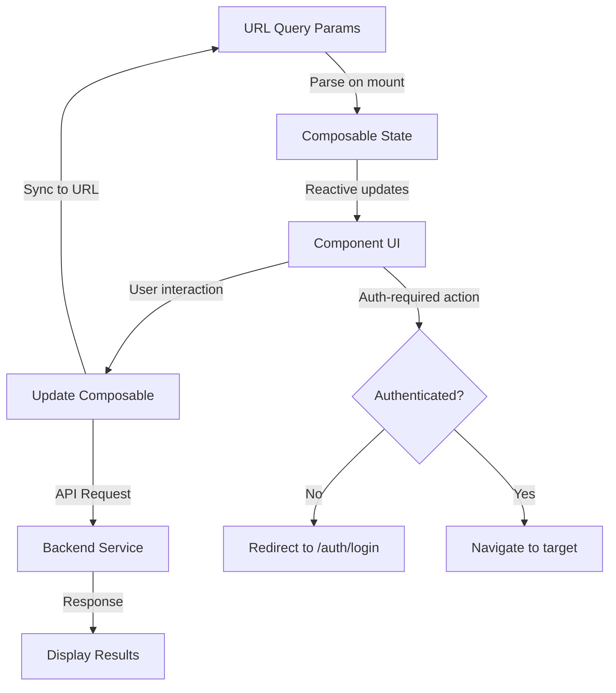

# Design Document: Public Pages Phase 1

## Overview

This design document outlines the technical implementation for Phase 1 of the public-facing pages for a lawyer search platform. The feature encompasses four distinct pages that serve unauthenticated users: a search results page (`/lawyers`), a practice areas directory (`/practice-areas`), an informational workflow page (`/how-it-works`), and a lawyer recruitment page (`/for-lawyers`).

The implementation leverages Nuxt 3's file-based routing, Nuxt UI components for consistent design, and Vue 3's Composition API for state management. The design prioritizes URL-based state persistence, progressive enhancement, and seamless authentication redirects.

### Key Design Principles

1. **URL as Source of Truth**: All search and filter state is encoded in URL query parameters, enabling bookmarking, sharing, and browser history navigation
2. **Component Reusability**: Existing components (LawyerCard, LawyerSearch) are extended and reused across pages
3. **Authentication-Aware Navigation**: Unauthenticated users are redirected to login with return URLs preserved
4. **Progressive Enhancement**: Pages function without JavaScript, with enhanced interactivity when available
5. **Performance First**: Static generation where possible, with client-side hydration for interactive elements

## Architecture

### Page Structure

The application follows Nuxt 3's file-based routing convention:

```
app/pages/
├── lawyers/
│   └── index.vue          # Search results page (/lawyers)
├── practice-areas/
│   └── index.vue          # Practice areas directory (/practice-areas)
├── how-it-works/
│   └── index.vue          # Platform workflow explanation (/how-it-works)
└── for-lawyers/
    └── index.vue          # Lawyer recruitment page (/for-lawyers)
```

### State Management Strategy

**URL Query Parameters** (via @peterbud/nuxt-query):
- Search criteria (practice area, location, consultation type)
- Filter values (rating, experience, price range)
- Pagination state (page number, items per page)

**Pinia Store** (for client-side state):
- Authentication status
- User session data
- Temporary UI state (filter panel open/closed)

**Composables** (for shared logic):
- `useLawyerSearch`: Search state management (already exists)
- `useLawyerFilters`: Filter state and URL synchronization (new)
- `useAuthRedirect`: Authentication-aware navigation (new)
- `usePagination`: Pagination logic (new)

### Data Flow



## Components and Interfaces

### New Components

#### 1. FilterPanel.vue

A sidebar component for the search results page containing all filter controls.

**Props:**
```typescript
interface FilterPanelProps {
  modelValue: FilterState
  practiceAreas: string[]
  loading?: boolean
}
```

**Emits:**
```typescript
interface FilterPanelEmits {
  'update:modelValue': [value: FilterState]
  'reset': []
}
```

**FilterState Interface:**
```typescript
interface FilterState {
  practiceAreas: string[]
  location: string
  consultationTypes: ConsultationType[]
  minRating: number | null
  minExperience: number | null
  priceRange: {
    min: number | null
    max: number | null
  }
}
```

#### 2. PracticeAreaGrid.vue

Displays a grid of practice area cards with icons, names, and lawyer counts.

**Props:**
```typescript
interface PracticeAreaGridProps {
  areas: PracticeArea[]
  columns?: 2 | 3 | 4
}

interface PracticeArea {
  id: string
  name: string
  slug: string
  icon: string
  lawyerCount: number
  description?: string
}
```

#### 3. HowItWorksStep.vue

Displays a single step in the workflow with illustration, title, and description.

**Props:**
```typescript
interface HowItWorksStepProps {
  step: WorkflowStep
  index: number
}

interface WorkflowStep {
  title: string
  description: string
  icon: string
  illustration?: string
}
```

#### 4. BenefitCard.vue

Displays a benefit section on the For Lawyers page.

**Props:**
```typescript
interface BenefitCardProps {
  benefit: Benefit
}

interface Benefit {
  title: string
  description: string
  icon: string
  features: string[]
}
```

#### 5. EmptyState.vue

Generic empty state component for when no results are found.

**Props:**
```typescript
interface EmptyStateProps {
  title: string
  description: string
  actionText?: string
  actionHref?: string
}
```

### Enhanced Existing Components

#### LawyerCard.vue (Modifications)

Add authentication-aware click handlers:

```typescript
interface LawyerCardEmits {
  'view-profile': [lawyerId: string]
  'book-consultation': [lawyerId: string]
}
```

The component will emit events instead of directly navigating, allowing parent components to handle authentication checks.

### New Composables

#### useLawyerFilters.ts

Manages filter state and URL synchronization.

```typescript
interface UseLawyerFiltersReturn {
  filters: Ref<FilterState>
  updateFilter: (key: keyof FilterState, value: any) => void
  resetFilters: () => void
  applyFilters: () => void
  filtersFromQuery: (query: LocationQuery) => FilterState
  filtersToQuery: (filters: FilterState) => LocationQuery
}

export function useLawyerFilters(): UseLawyerFiltersReturn
```

**Implementation Notes:**
- Uses `useRoute()` and `useRouter()` from Vue Router
- Watches route query changes and updates filter state
- Debounces URL updates to avoid excessive history entries
- Serializes complex filter objects to URL-friendly strings

#### useAuthRedirect.ts

Handles authentication-aware navigation with return URLs.

```typescript
interface UseAuthRedirectReturn {
  isAuthenticated: ComputedRef<boolean>
  navigateWithAuth: (path: string) => Promise<void>
  requireAuth: (callback: () => void) => void
}

export function useAuthRedirect(): UseAuthRedirectReturn
```

**Implementation Notes:**
- Checks authentication status from Pinia store or session
- Constructs redirect URLs with current path as query parameter
- Preserves query parameters when redirecting back after login

#### usePagination.ts

Manages pagination state and URL synchronization.

```typescript
interface UsePaginationOptions {
  itemsPerPage?: number
  totalItems: Ref<number>
}

interface UsePaginationReturn {
  currentPage: Ref<number>
  itemsPerPage: Ref<number>
  totalPages: ComputedRef<number>
  hasNextPage: ComputedRef<boolean>
  hasPreviousPage: ComputedRef<boolean>
  goToPage: (page: number) => void
  nextPage: () => void
  previousPage: () => void
  paginatedItems: <T>(items: T[]) => ComputedRef<T[]>
}

export function usePagination(options: UsePaginationOptions): UsePaginationReturn
```

## Data Models

### Lawyer

```typescript
interface Lawyer {
  id: string
  name: string
  avatar?: string
  verified: boolean
  specialty: string
  practiceAreas: string[]
  location: string
  yearsExperience: number
  rating: number
  consultationTypes: ConsultationType[]
  priceRange: {
    min: number
    max: number
  }
  bio?: string
  education?: string[]
  barAdmissions?: string[]
}

type ConsultationType = 'video' | 'phone' | 'in-person'
```

### PracticeArea

```typescript
interface PracticeArea {
  id: string
  name: string
  slug: string
  icon: string
  lawyerCount: number
  description: string
  popularSearches?: string[]
}
```

### SearchQuery

```typescript
interface SearchQuery {
  practiceArea?: string
  location?: string
  consultationType?: ConsultationType
  page?: number
  limit?: number
}
```

### FilterQuery

```typescript
interface FilterQuery extends SearchQuery {
  practiceAreas?: string[]
  minRating?: number
  minExperience?: number
  priceMin?: number
  priceMax?: number
}
```

## Page Implementations

### /lawyers (Search Results Page)

**Layout:**
- Sticky header with NavigationBar
- Search bar (LawyerSearch component) - sticky below nav when scrolled
- Two-column layout: FilterPanel (left sidebar) + Results grid (main content)
- Pagination controls at bottom

**URL Query Parameters:**
```
/lawyers?area=family-law&location=Paris&type=video&rating=4&experience=5&page=2
```

**Query Parameter Mapping:**
- `area`: Practice area slug (single value)
- `location`: Location string
- `type`: Consultation type (video|phone|in-person)
- `rating`: Minimum rating (1-5)
- `experience`: Minimum years of experience
- `priceMin`: Minimum price
- `priceMax`: Maximum price
- `page`: Current page number

**Component Structure:**
```vue
<template>
  <div>
    <NavigationBar />
    <div class="sticky-search-container">
      <LawyerSearch
        :is-scrolled="isScrolled"
        @search="handleSearch"
      />
    </div>
    <div class="results-layout">
      <FilterPanel
        v-model="filters"
        :practice-areas="practiceAreas"
        @reset="resetFilters"
      />
      <div class="results-content">
        <div v-if="loading" class="loading-state">
          <!-- Skeleton loaders -->
        </div>
        <div v-else-if="lawyers.length === 0" class="empty-state">
          <EmptyState
            title="No lawyers found"
            description="Try adjusting your filters"
            action-text="Reset Filters"
            @action="resetFilters"
          />
        </div>
        <div v-else class="lawyer-grid">
          <LawyerCard
            v-for="lawyer in lawyers"
            :key="lawyer.id"
            :lawyer="lawyer"
            @view-profile="handleViewProfile"
            @book-consultation="handleBookConsultation"
          />
        </div>
        <UPagination
          v-if="totalPages > 1"
          v-model="currentPage"
          :total="totalItems"
          :per-page="itemsPerPage"
        />
      </div>
    </div>
  </div>
</template>
```

**Data Fetching Strategy:**
- Use `useFetch` or `useAsyncData` with query parameters as keys
- Fetch on server-side for initial render (SSR)
- Refetch on client when filters change
- Implement debouncing for filter changes to reduce API calls

### /practice-areas (Practice Areas Directory)

**Layout:**
- NavigationBar
- Hero section with headline
- Grid of practice area cards (3-4 columns on desktop, 1-2 on mobile)
- Each card links to `/lawyers?area=[slug]`

**Component Structure:**
```vue
<template>
  <div>
    <NavigationBar />
    <section class="hero-section">
      <h1>Explore Legal Practice Areas</h1>
      <p>Find specialized lawyers across all areas of law</p>
    </section>
    <section class="practice-areas-grid">
      <PracticeAreaGrid :areas="practiceAreas" :columns="3" />
    </section>
    <FooterSection />
  </div>
</template>
```

**Data:**
```typescript
const practiceAreas: PracticeArea[] = [
  {
    id: '1',
    name: 'Family Law',
    slug: 'family-law',
    icon: 'i-heroicons-users',
    lawyerCount: 245,
    description: 'Divorce, custody, adoption, and family matters'
  },
  // ... 11 more areas
]
```

### /how-it-works (Platform Workflow)

**Layout:**
- NavigationBar
- Hero section
- 5 workflow steps displayed vertically with alternating left/right layout
- CTA button at bottom linking to `/lawyers`

**Component Structure:**
```vue
<template>
  <div>
    <NavigationBar />
    <section class="hero-section">
      <h1>How It Works</h1>
      <p>Find and connect with qualified lawyers in 5 simple steps</p>
    </section>
    <section class="workflow-steps">
      <HowItWorksStep
        v-for="(step, index) in workflowSteps"
        :key="index"
        :step="step"
        :index="index"
      />
    </section>
    <section class="cta-section">
      <UButton
        size="xl"
        to="/lawyers"
      >
        Find Your Lawyer
      </UButton>
    </section>
    <FooterSection />
  </div>
</template>
```

**Workflow Steps Data:**
```typescript
const workflowSteps: WorkflowStep[] = [
  {
    title: 'Search for Lawyers',
    description: 'Browse our directory of verified lawyers by practice area, location, and consultation type',
    icon: 'i-heroicons-magnifying-glass'
  },
  {
    title: 'Review Profiles',
    description: 'Compare qualifications, experience, ratings, and client reviews',
    icon: 'i-heroicons-document-text'
  },
  {
    title: 'Book a Consultation',
    description: 'Schedule a video, phone, or in-person consultation at your convenience',
    icon: 'i-heroicons-calendar'
  },
  {
    title: 'Meet Your Lawyer',
    description: 'Discuss your legal needs and get expert advice',
    icon: 'i-heroicons-video-camera'
  },
  {
    title: 'Secure Representation',
    description: 'Hire your lawyer and manage your case through our platform',
    icon: 'i-heroicons-check-badge'
  }
]
```

### /for-lawyers (Lawyer Recruitment)

**Layout:**
- NavigationBar
- Hero section with CTA button
- 4 benefit sections (grid layout)
- Pricing/subscription information
- Testimonials section
- Final CTA section

**Component Structure:**
```vue
<template>
  <div>
    <NavigationBar />
    
    <section class="hero-section">
      <h1>Grow Your Practice with LexConnect</h1>
      <p>Join thousands of lawyers connecting with clients</p>
      <UButton
        size="xl"
        to="/auth/register?role=lawyer"
      >
        Register as a Lawyer
      </UButton>
    </section>
    
    <section class="benefits-section">
      <div class="benefits-grid">
        <BenefitCard
          v-for="benefit in benefits"
          :key="benefit.title"
          :benefit="benefit"
        />
      </div>
    </section>
    
    <section class="pricing-section">
      <h2>Transparent Pricing</h2>
      <div class="pricing-card">
        <!-- Pricing details -->
      </div>
    </section>
    
    <section class="testimonials-section">
      <h2>What Lawyers Say</h2>
      <div class="testimonials-grid">
        <!-- Testimonial cards -->
      </div>
    </section>
    
    <section class="final-cta">
      <h2>Ready to Get Started?</h2>
      <UButton
        size="xl"
        to="/auth/register?role=lawyer"
      >
        Register as a Lawyer
      </UButton>
    </section>
    
    <FooterSection />
  </div>
</template>
```

**Benefits Data:**
```typescript
const benefits: Benefit[] = [
  {
    title: 'Bar-Verified Credentials',
    description: 'Build trust with verified bar credentials',
    icon: 'i-heroicons-shield-check',
    features: [
      'Automated bar verification',
      'Verified badge on profile',
      'Increased client confidence'
    ]
  },
  {
    title: 'Smart Booking Calendar',
    description: 'Manage your availability effortlessly',
    icon: 'i-heroicons-calendar-days',
    features: [
      'Sync with your calendar',
      'Automated reminders',
      'Flexible scheduling'
    ]
  },
  {
    title: 'Direct Client Communication',
    description: 'Secure messaging and video consultations',
    icon: 'i-heroicons-chat-bubble-left-right',
    features: [
      'Encrypted messaging',
      'Video consultation platform',
      'Document sharing'
    ]
  },
  {
    title: 'Zero Commission Model',
    description: 'Keep 100% of your consultation fees',
    icon: 'i-heroicons-currency-dollar',
    features: [
      'No commission fees',
      'Direct payments',
      'Transparent pricing'
    ]
  }
]
```

## Authentication Flow

### Unauthenticated User Actions

When an unauthenticated user clicks "View Profile" or "Book Consultation":

1. Event handler in parent component receives the event
2. `useAuthRedirect` composable checks authentication status
3. If not authenticated, construct redirect URL:
   ```
   /auth/login?redirect=/lawyers/[lawyer-id]
   ```
4. Navigate to login page using `navigateTo()`
5. After successful login, auth system redirects to the URL in `redirect` parameter

**Implementation in LawyerCard parent:**
```typescript
const { isAuthenticated, navigateWithAuth } = useAuthRedirect()

const handleViewProfile = (lawyerId: string) => {
  navigateWithAuth(`/lawyers/${lawyerId}`)
}

const handleBookConsultation = (lawyerId: string) => {
  navigateWithAuth(`/lawyers/${lawyerId}`)
}
```

**useAuthRedirect implementation:**
```typescript
export function useAuthRedirect() {
  const router = useRouter()
  const route = useRoute()
  const authStore = useAuthStore() // Pinia store
  
  const isAuthenticated = computed(() => authStore.isAuthenticated)
  
  const navigateWithAuth = async (targetPath: string) => {
    if (isAuthenticated.value) {
      await navigateTo(targetPath)
    } else {
      const redirectUrl = `/auth/login?redirect=${encodeURIComponent(targetPath)}`
      await navigateTo(redirectUrl)
    }
  }
  
  return {
    isAuthenticated,
    navigateWithAuth
  }
}
```

## URL State Management

### Query Parameter Serialization

The `useLawyerFilters` composable handles bidirectional conversion between filter state and URL query parameters.

**Serialization Rules:**
- Arrays: Comma-separated strings (`practiceAreas=family-law,criminal-defense`)
- Numbers: String representation (`rating=4`)
- Null/undefined: Omitted from URL
- Objects: Flattened with prefixes (`priceMin=100&priceMax=500`)

**Implementation:**
```typescript
function filtersToQuery(filters: FilterState): LocationQuery {
  const query: LocationQuery = {}
  
  if (filters.practiceAreas.length > 0) {
    query.areas = filters.practiceAreas.join(',')
  }
  
  if (filters.location) {
    query.location = filters.location
  }
  
  if (filters.consultationTypes.length > 0) {
    query.types = filters.consultationTypes.join(',')
  }
  
  if (filters.minRating !== null) {
    query.rating = filters.minRating.toString()
  }
  
  if (filters.minExperience !== null) {
    query.experience = filters.minExperience.toString()
  }
  
  if (filters.priceRange.min !== null) {
    query.priceMin = filters.priceRange.min.toString()
  }
  
  if (filters.priceRange.max !== null) {
    query.priceMax = filters.priceRange.max.toString()
  }
  
  return query
}

function filtersFromQuery(query: LocationQuery): FilterState {
  return {
    practiceAreas: query.areas ? String(query.areas).split(',') : [],
    location: query.location ? String(query.location) : '',
    consultationTypes: query.types ? String(query.types).split(',') as ConsultationType[] : [],
    minRating: query.rating ? Number(query.rating) : null,
    minExperience: query.experience ? Number(query.experience) : null,
    priceRange: {
      min: query.priceMin ? Number(query.priceMin) : null,
      max: query.priceMax ? Number(query.priceMax) : null
    }
  }
}
```

### URL Update Strategy

To avoid excessive browser history entries, filter changes are debounced:

```typescript
import { useDebounceFn } from '@vueuse/core'

const updateURL = useDebounceFn((filters: FilterState) => {
  const query = filtersToQuery(filters)
  router.push({ query })
}, 500)
```

### Initial State Hydration

On page load, filters are initialized from URL query parameters:

```typescript
onMounted(() => {
  const route = useRoute()
  filters.value = filtersFromQuery(route.query)
})
```


## Correctness Properties

*A property is a characteristic or behavior that should hold true across all valid executions of a system—essentially, a formal statement about what the system should do. Properties serve as the bridge between human-readable specifications and machine-verifiable correctness guarantees.*

### Property Reflection

After analyzing all acceptance criteria, I identified several areas where properties can be consolidated:

**Lawyer Card Display Properties (2.1-2.10)**: These 10 criteria all test that specific information is displayed on a lawyer card. Rather than having 10 separate properties, these can be combined into a single comprehensive property that validates all required fields are present in the rendered output.

**Authentication Redirect Properties (3.1-3.2)**: Both criteria test the same behavior (redirect to login with correct URL) for different buttons. These can be combined into one property.

**Authentication Navigation Properties (3.3-3.4)**: Both criteria test the same behavior (direct navigation) for authenticated users. These can be combined into one property.

**Filter URL Synchronization (7.2 and 8.1)**: These are testing the same behavior - that filter changes update the URL. Property 8.1 subsumes 7.2.

**URL Round-Trip (1.2 and 8.2)**: Both test that URL query parameters correctly populate filters. Property 8.2 is more comprehensive as it tests the full round-trip.

After consolidation, we have the following unique properties:

### Property 1: Query Parameter Hydration

*For any* valid set of query parameters representing search filters, when the Search Results Page loads with those parameters, the search bar and filter panel should be populated with the corresponding values.

**Validates: Requirements 1.2, 8.2**

### Property 2: Lawyer Card Required Fields

*For any* lawyer object, the rendered LawyerCard component should contain all required fields: avatar or initials, name, primary practice area, location, years of experience, star rating, 2-3 specialty tags, "View Profile" button, and "Book Consultation" button.

**Validates: Requirements 2.1, 2.2, 2.4, 2.5, 2.6, 2.7, 2.8, 2.9, 2.10**

### Property 3: Verified Badge Display

*For any* lawyer object, the rendered LawyerCard should display a verified badge if and only if the lawyer's verified property is true.

**Validates: Requirements 2.3**

### Property 4: Unauthenticated User Redirect

*For any* lawyer ID, when an unauthenticated user clicks either "View Profile" or "Book Consultation" on a LawyerCard, the system should redirect to `/auth/login?redirect=/lawyers/[id]` where [id] is the lawyer's ID.

**Validates: Requirements 3.1, 3.2**

### Property 5: Authenticated User Navigation

*For any* lawyer ID, when an authenticated user clicks either "View Profile" or "Book Consultation" on a LawyerCard, the system should navigate directly to `/lawyers/[id]` without redirecting to login.

**Validates: Requirements 3.3, 3.4**

### Property 6: Practice Area Card Display

*For any* practice area object, the rendered practice area card should display an icon, name, and lawyer count.

**Validates: Requirements 4.3**

### Property 7: Practice Area Navigation

*For any* practice area with a slug, when a user clicks on that practice area card, the system should navigate to `/lawyers?area=[slug]` where [slug] is the practice area's slug.

**Validates: Requirements 4.4**

### Property 8: Workflow Step Display

*For any* workflow step object, the rendered step component should display an icon or illustration, title, and detailed description.

**Validates: Requirements 5.2**

### Property 9: Filter Changes Update Results

*For any* filter modification in the Filter Panel, the displayed lawyer cards should be updated to show only lawyers matching the new filter criteria.

**Validates: Requirements 7.1**

### Property 10: Filter State URL Encoding

*For any* filter state object, encoding it to URL query parameters and then decoding those parameters back to a filter state should produce an equivalent filter state (round-trip property).

**Validates: Requirements 7.2, 8.1, 8.2**

### Property 11: URL Validity

*For any* filter state, the generated URL with encoded query parameters should be a valid, shareable URL that can be bookmarked and shared.

**Validates: Requirements 8.3**

## Error Handling

### Client-Side Error Scenarios

**1. Invalid Query Parameters**
- **Scenario**: User navigates to URL with malformed query parameters
- **Handling**: Parse parameters defensively, ignore invalid values, use defaults
- **User Experience**: Display default search results, show notification if parameters were invalid

**2. Network Failures During Search**
- **Scenario**: API request fails due to network issues
- **Handling**: Catch fetch errors, display error state with retry button
- **User Experience**: Show error message: "Unable to load results. Please try again."

**3. Empty Search Results**
- **Scenario**: No lawyers match the current filter criteria
- **Handling**: Display EmptyState component with helpful message
- **User Experience**: Suggest adjusting filters or resetting to defaults

**4. Authentication State Uncertainty**
- **Scenario**: Unable to determine if user is authenticated
- **Handling**: Assume unauthenticated, redirect to login if needed
- **User Experience**: Seamless redirect with return URL preserved

**5. Missing Practice Area Data**
- **Scenario**: Practice area referenced in URL doesn't exist
- **Handling**: Ignore invalid practice area, show all results
- **User Experience**: Display notification: "Practice area not found, showing all results"

### Error Boundaries

Implement Vue error boundaries for each major page section:

```typescript
// In each page component
onErrorCaptured((err, instance, info) => {
  console.error('Error in component:', err, info)
  // Log to error tracking service
  // Display fallback UI
  return false // Prevent error propagation
})
```

### Validation

**URL Query Parameter Validation:**
```typescript
function validateQueryParams(query: LocationQuery): ValidationResult {
  const errors: string[] = []
  
  // Validate rating (1-5)
  if (query.rating && (Number(query.rating) < 1 || Number(query.rating) > 5)) {
    errors.push('Invalid rating value')
  }
  
  // Validate experience (0-50)
  if (query.experience && (Number(query.experience) < 0 || Number(query.experience) > 50)) {
    errors.push('Invalid experience value')
  }
  
  // Validate price range
  if (query.priceMin && query.priceMax && Number(query.priceMin) > Number(query.priceMax)) {
    errors.push('Minimum price cannot exceed maximum price')
  }
  
  // Validate consultation type
  const validTypes = ['video', 'phone', 'in-person']
  if (query.type && !validTypes.includes(String(query.type))) {
    errors.push('Invalid consultation type')
  }
  
  return {
    valid: errors.length === 0,
    errors
  }
}
```

**Filter State Validation:**
```typescript
function validateFilterState(filters: FilterState): boolean {
  // Ensure rating is within bounds
  if (filters.minRating !== null && (filters.minRating < 1 || filters.minRating > 5)) {
    return false
  }
  
  // Ensure experience is non-negative
  if (filters.minExperience !== null && filters.minExperience < 0) {
    return false
  }
  
  // Ensure price range is valid
  if (filters.priceRange.min !== null && filters.priceRange.max !== null) {
    if (filters.priceRange.min > filters.priceRange.max) {
      return false
    }
  }
  
  return true
}
```

## Testing Strategy

### Dual Testing Approach

This feature will employ both unit testing and property-based testing to ensure comprehensive coverage:

**Unit Tests** will focus on:
- Specific examples of page rendering (e.g., "Practice Areas page displays exactly 12 areas")
- Edge cases (e.g., empty search results, missing avatar images)
- Integration points (e.g., navigation between pages)
- Error conditions (e.g., invalid query parameters, network failures)

**Property-Based Tests** will focus on:
- Universal properties that hold for all inputs (e.g., "for any lawyer, the card displays required fields")
- Round-trip properties (e.g., filter state → URL → filter state)
- Invariants (e.g., "authenticated users never see login redirects")

Together, these approaches provide comprehensive coverage: unit tests catch concrete bugs in specific scenarios, while property tests verify general correctness across a wide range of inputs.

### Property-Based Testing Configuration

**Framework**: We will use **fast-check** for property-based testing in this Nuxt 3/TypeScript application.

**Configuration**:
- Each property test will run a minimum of 100 iterations
- Each test will be tagged with a comment referencing the design document property
- Tag format: `// Feature: public-pages-phase-1, Property {number}: {property_text}`

**Example Property Test Structure**:
```typescript
import fc from 'fast-check'
import { describe, it, expect } from 'vitest'

describe('Property 10: Filter State URL Encoding', () => {
  // Feature: public-pages-phase-1, Property 10: Filter state round-trip
  it('should preserve filter state through URL encoding round-trip', () => {
    fc.assert(
      fc.property(
        filterStateArbitrary(),
        (filterState) => {
          const query = filtersToQuery(filterState)
          const decoded = filtersFromQuery(query)
          expect(decoded).toEqual(filterState)
        }
      ),
      { numRuns: 100 }
    )
  })
})
```

**Generators (Arbitraries)**:

We will create custom generators for domain objects:

```typescript
// Lawyer generator
function lawyerArbitrary(): fc.Arbitrary<Lawyer> {
  return fc.record({
    id: fc.uuid(),
    name: fc.fullName(),
    avatar: fc.option(fc.webUrl(), { nil: undefined }),
    verified: fc.boolean(),
    specialty: fc.constantFrom('Family Law', 'Criminal Defense', 'Corporate Law'),
    practiceAreas: fc.array(fc.string(), { minLength: 2, maxLength: 3 }),
    location: fc.city(),
    yearsExperience: fc.integer({ min: 0, max: 50 }),
    rating: fc.float({ min: 1, max: 5 }),
    consultationTypes: fc.array(
      fc.constantFrom('video', 'phone', 'in-person'),
      { minLength: 1, maxLength: 3 }
    ),
    priceRange: fc.record({
      min: fc.integer({ min: 50, max: 500 }),
      max: fc.integer({ min: 100, max: 1000 })
    })
  })
}

// Filter state generator
function filterStateArbitrary(): fc.Arbitrary<FilterState> {
  return fc.record({
    practiceAreas: fc.array(fc.string(), { maxLength: 5 }),
    location: fc.string(),
    consultationTypes: fc.array(
      fc.constantFrom('video', 'phone', 'in-person'),
      { maxLength: 3 }
    ),
    minRating: fc.option(fc.integer({ min: 1, max: 5 }), { nil: null }),
    minExperience: fc.option(fc.integer({ min: 0, max: 50 }), { nil: null }),
    priceRange: fc.record({
      min: fc.option(fc.integer({ min: 0, max: 1000 }), { nil: null }),
      max: fc.option(fc.integer({ min: 0, max: 1000 }), { nil: null })
    })
  })
}

// Query parameters generator
function queryParamsArbitrary(): fc.Arbitrary<LocationQuery> {
  return fc.record({
    area: fc.option(fc.string()),
    location: fc.option(fc.string()),
    type: fc.option(fc.constantFrom('video', 'phone', 'in-person')),
    rating: fc.option(fc.integer({ min: 1, max: 5 }).map(String)),
    experience: fc.option(fc.integer({ min: 0, max: 50 }).map(String)),
    priceMin: fc.option(fc.integer({ min: 0, max: 1000 }).map(String)),
    priceMax: fc.option(fc.integer({ min: 0, max: 1000 }).map(String)),
    page: fc.option(fc.integer({ min: 1, max: 100 }).map(String))
  })
}
```

### Unit Testing Strategy

**Component Tests** (using Vitest + Vue Test Utils):
- Test each page component renders correctly
- Test user interactions (clicks, form inputs)
- Test conditional rendering (empty states, loading states)
- Mock API calls and test response handling

**Composable Tests**:
- Test `useLawyerFilters` state management
- Test `useAuthRedirect` authentication logic
- Test `usePagination` calculations

**Integration Tests**:
- Test navigation flows between pages
- Test URL state persistence across navigation
- Test authentication redirect flows

**Example Unit Test**:
```typescript
import { mount } from '@vue/test-utils'
import { describe, it, expect } from 'vitest'
import LawyerCard from '~/components/LawyerCard.vue'

describe('LawyerCard', () => {
  it('displays verified badge when lawyer is verified', () => {
    const lawyer = {
      id: '1',
      name: 'John Doe',
      verified: true,
      // ... other required fields
    }
    
    const wrapper = mount(LawyerCard, {
      props: { lawyer }
    })
    
    expect(wrapper.find('.verified-badge').exists()).toBe(true)
  })
  
  it('does not display verified badge when lawyer is not verified', () => {
    const lawyer = {
      id: '1',
      name: 'Jane Smith',
      verified: false,
      // ... other required fields
    }
    
    const wrapper = mount(LawyerCard, {
      props: { lawyer }
    })
    
    expect(wrapper.find('.verified-badge').exists()).toBe(false)
  })
})
```

### Test Coverage Goals

- **Unit Test Coverage**: Minimum 80% line coverage for components and composables
- **Property Test Coverage**: All 11 correctness properties must have corresponding property tests
- **Integration Test Coverage**: All critical user flows (search, filter, navigate, authenticate)

### Testing Tools

- **Test Runner**: Vitest
- **Component Testing**: @vue/test-utils
- **Property-Based Testing**: fast-check
- **Mocking**: vitest mocks for API calls and router
- **Coverage**: vitest coverage (c8)

