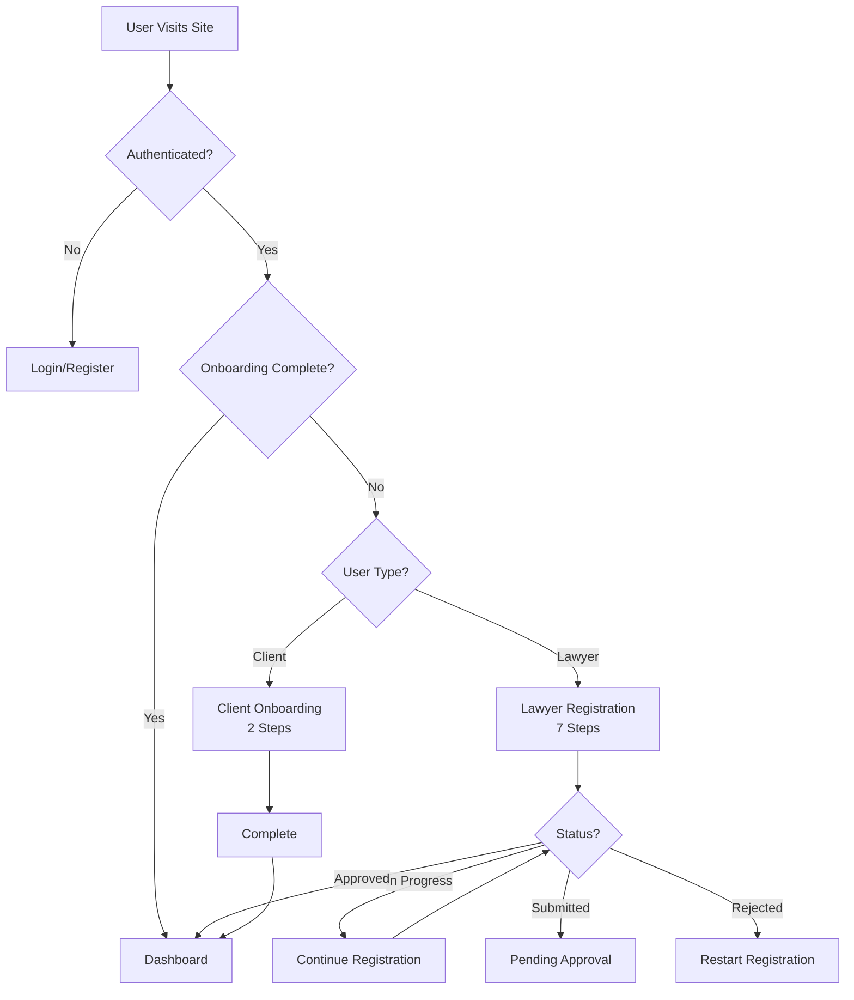
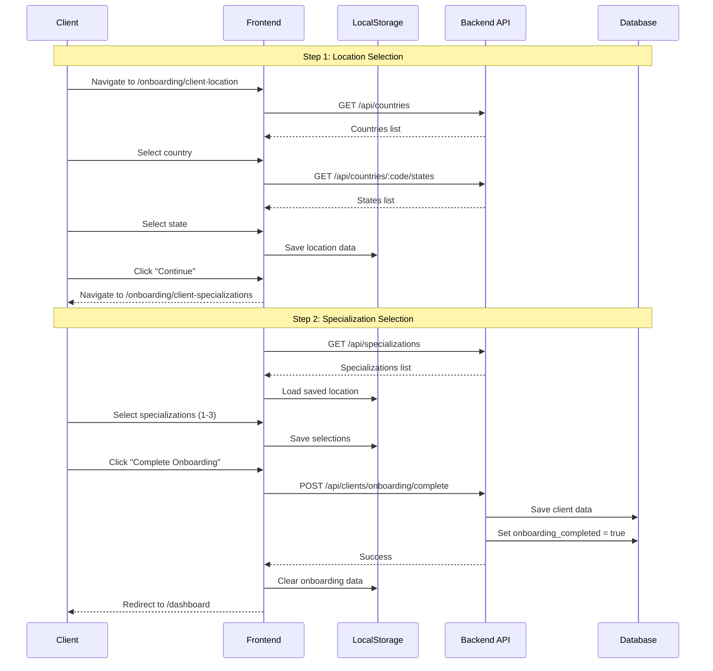
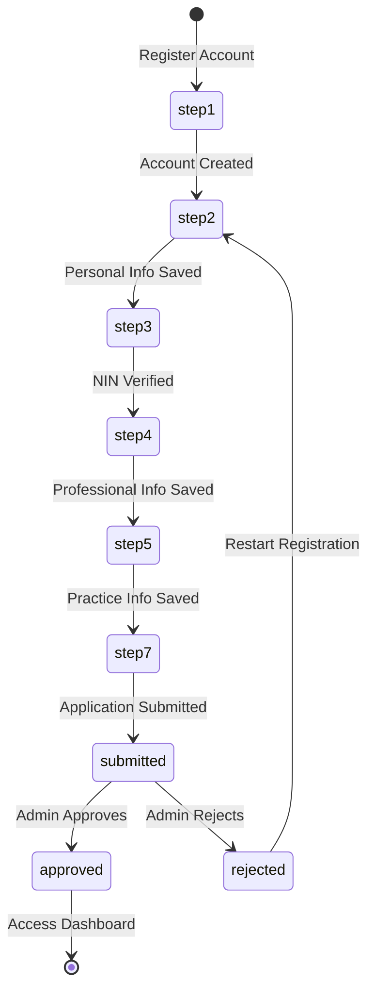
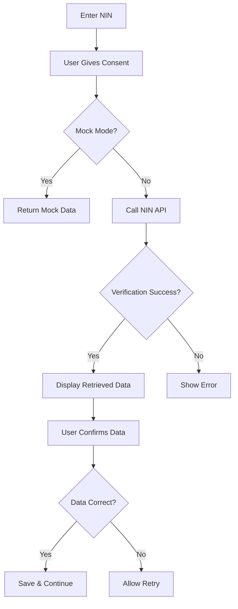

# Complete Onboarding Flows - Nuxt Conversion Guide

**Project:** GetALawyer Frontend  
**Purpose:** Comprehensive guide for converting React/TanStack Start onboarding flows to Nuxt  
**Version:** 1.0.0  
**Date:** March 7, 2026

---

## Table of Contents

1. [System Overview](#system-overview)
2. [Authentication Architecture](#authentication-architecture)
3. [Client Onboarding Flow](#client-onboarding-flow)
4. [Lawyer Onboarding Flow](#lawyer-onboarding-flow)
5. [Route Structure & Guards](#route-structure--guards)
6. [State Management](#state-management)
7. [API Integration](#api-integration)
8. [Nuxt Conversion Strategy](#nuxt-conversion-strategy)
9. [Component Mapping](#component-mapping)
10. [Implementation Checklist](#implementation-checklist)

---

## 1. System Overview

### Current Tech Stack (React)

```typescript
// Framework & Routing
- TanStack Start (Full-stack React framework with SSR)
- TanStack Router (Type-safe routing with route guards)
- React 19.2.0

// Authentication
- Better Auth 1.4.6 (Cookie-based sessions)
- Email/Password + Social OAuth (Google, Apple)
- Email OTP verification

// State Management
- TanStack Query 5.x (Server state & caching)
- Zustand 5.x (Client state)
- React Hook Form 7.x (Form state)
- localStorage (Draft data persistence)

// Validation
- Zod 4.2.1 (Schema validation)
```

### Target Tech Stack (Nuxt)

```typescript
// Framework & Routing
- Nuxt 3.x (Vue-based full-stack framework with SSR)
- Nuxt Router (File-based routing with middleware)
- Vue 3.x

// Authentication
- Better Auth 1.4.6 (Same - cookie-based sessions)
- Nuxt Auth Utils or custom composables
- Email/Password + Social OAuth

// State Management
- Pinia (Vue state management)
- Nuxt useAsyncData / useFetch (Server state)
- VeeValidate or Vuelidate (Form validation)
- localStorage / sessionStorage (Draft data)

// Validation
- Zod 4.2.1 (Same - schema validation)
```

### User Types & Flows


| User Type | Onboarding Steps | Complexity | Estimated Time |
|-----------|------------------|------------|----------------|
| **Client** | 2 steps (Location + Specializations) | Simple | 2-3 minutes |
| **Lawyer** | 7 steps (Account → Review & Submit) | Complex | 15-20 minutes |

### High-Level Flow Diagram



---

## 2. Authentication Architecture

### Better Auth Integration

Better Auth works the same in both React and Nuxt - it's framework-agnostic.

#### Current React Implementation

```typescript
// src/lib/auth-client.ts
import { createAuthClient } from "better-auth/react";

export const authClient = createAuthClient({
  baseURL: import.meta.env.VITE_API_URL,
  fetchOptions: {
    credentials: "include", // Cookie-based sessions
  },
  plugins: [
    inferAdditionalFields({
      user: {
        role: { type: "string", required: false },
        onboarding_completed: { type: "boolean" },
      },
    }),
    emailOTPClient(),
  ],
});

// Exported methods
export const {
  getSession,
  useSession,
  signIn,
  signUp,
  signOut,
  forgetPassword,
  resetPassword,
} = authClient;
```

#### Nuxt Implementation Strategy

```typescript
// composables/useAuth.ts
import { createAuthClient } from "better-auth/client";

const authClient = createAuthClient({
  baseURL: useRuntimeConfig().public.apiUrl,
  fetchOptions: {
    credentials: "include",
  },
  plugins: [
    inferAdditionalFields({
      user: {
        role: { type: "string", required: false },
        onboarding_completed: { type: "boolean" },
      },
    }),
    emailOTPClient(),
  ],
});

export const useAuth = () => {
  const session = useState('auth-session', () => null);
  
  const getSession = async () => {
    const data = await authClient.getSession();
    session.value = data;
    return data;
  };
  
  const signIn = async (credentials) => {
    const result = await authClient.signIn.email(credentials);
    if (!result.error) {
      await getSession();
    }
    return result;
  };
  
  const signUp = async (data) => {
    const result = await authClient.signUp.email(data);
    if (!result.error) {
      await getSession();
    }
    return result;
  };
  
  const signOut = async () => {
    await authClient.signOut();
    session.value = null;
    await navigateTo('/login');
  };
  
  return {
    session: readonly(session),
    getSession,
    signIn,
    signUp,
    signOut,
    forgetPassword: authClient.forgetPassword,
    resetPassword: authClient.resetPassword,
  };
};
```


### Session Management

#### React (Server Function)

```typescript
// src/functions/get-user.ts
import { createServerFn } from "@tanstack/react-start";

export const getUser = createServerFn({ method: "GET" }).handler(async () => {
  const request = getRequest();
  const cookieHeader = request.headers.get("cookie") || "";
  
  const session = await authClient.getSession({
    fetchOptions: {
      headers: { cookie: cookieHeader },
    },
  });
  
  return session.data || null;
});
```

#### Nuxt (Server Middleware)

```typescript
// server/middleware/auth.ts
export default defineEventHandler(async (event) => {
  const cookieHeader = getHeader(event, 'cookie') || '';
  
  if (!cookieHeader.includes('auth.token=')) {
    event.context.user = null;
    return;
  }
  
  try {
    const session = await authClient.getSession({
      fetchOptions: {
        headers: { cookie: cookieHeader },
      },
    });
    
    event.context.user = session?.data?.user || null;
  } catch (error) {
    event.context.user = null;
  }
});
```

```typescript
// composables/useUser.ts
export const useUser = () => {
  return useState('user', () => null);
};

export const fetchUser = async () => {
  const user = useUser();
  const { data } = await useFetch('/api/auth/session');
  user.value = data.value?.user || null;
  return user.value;
};
```

### Session Structure

```typescript
interface Session {
  user: {
    id: string;
    email: string;
    name: string;
    role: "user" | "lawyer";
    onboarding_completed: boolean;
    image?: string;
    emailVerified: boolean;
    createdAt: string;
    updatedAt: string;
  };
  session: {
    id: string;
    userId: string;
    expiresAt: string;
    token: string;
  };
}
```

---

## 3. Client Onboarding Flow

### Overview

Clients have a simple 2-step onboarding process after account creation:

1. **Location Selection** - Country and State
2. **Specialization Selection** - Legal practice areas of interest

### Flow Diagram




### Step 1: Location Selection

#### Current React Implementation

**File:** `src/routes/(protected)/onboarding/(client)/client-location.tsx`

**Key Features:**
- Country dropdown with all countries
- State dropdown (dependent on country selection)
- Auto-save to localStorage
- Form validation
- Loading and error states

**Data Structure:**
```typescript
interface OnboardingData {
  country: string;
  state: string;
  specializations: string[];
}

// LocalStorage key
const STORAGE_KEY = 'client-onboarding-data';
```

**React Code:**
```typescript
function OnboardingStep1() {
  const router = useRouter();
  const [country, setCountry] = useState('');
  const [state, setState] = useState('');
  const [errors, setErrors] = useState<Record<string, string>>({});

  // Load saved data on mount
  useEffect(() => {
    const saved = getOnboardingData();
    if (saved.country) setCountry(saved.country);
    if (saved.state) setState(saved.state);
  }, []);

  // Fetch countries and states
  const { data, isLoading, isError } = useCountriesWithStates();

  const handleCountryChange = (value: string) => {
    setCountry(value);
    setState("");
    setOnboardingData({ country: value, state: '' });
  };

  const handleStateChange = (value: string) => {
    setState(value);
    setOnboardingData({ state: value });
  };

  const validateAndNext = () => {
    const newErrors: Record<string, string> = {};
    if (!country) newErrors.country = "Please select a country";
    if (availableStates.length > 1 && !state) {
      newErrors.state = "Please select a state/region";
    }
    
    if (Object.keys(newErrors).length > 0) {
      setErrors(newErrors);
      return;
    }
    
    router.navigate({ to: "/onboarding/client-specializations" });
  };
}
```

#### Nuxt Implementation

**File:** `pages/onboarding/client-location.vue`

```vue
<script setup lang="ts">
definePageMeta({
  middleware: ['auth', 'onboarding-guard'],
  layout: 'onboarding',
});

interface OnboardingData {
  country: string;
  state: string;
  specializations: string[];
}

const STORAGE_KEY = 'client-onboarding-data';

// State
const country = ref('');
const state = ref('');
const errors = ref<Record<string, string>>({});

// Load saved data
onMounted(() => {
  const saved = localStorage.getItem(STORAGE_KEY);
  if (saved) {
    const data = JSON.parse(saved) as OnboardingData;
    country.value = data.country || '';
    state.value = data.state || '';
  }
});

// Fetch countries and states
const { data: countriesData, pending: isLoading, error: isError } = await useFetch('/api/countries');

const countries = computed(() => countriesData.value?.data || []);
const availableStates = computed(() => {
  if (!country.value) return [];
  const selectedCountry = countries.value.find(c => c.code === country.value);
  return selectedCountry?.states || [];
});

// Handlers
const handleCountryChange = (value: string) => {
  country.value = value;
  state.value = '';
  saveToStorage({ country: value, state: '' });
  errors.value = {};
};

const handleStateChange = (value: string) => {
  state.value = value;
  saveToStorage({ state: value });
  errors.value = {};
};

const saveToStorage = (data: Partial<OnboardingData>) => {
  const current = JSON.parse(localStorage.getItem(STORAGE_KEY) || '{}');
  localStorage.setItem(STORAGE_KEY, JSON.stringify({ ...current, ...data }));
};

const validateAndNext = () => {
  const newErrors: Record<string, string> = {};
  
  if (!country.value) {
    newErrors.country = "Please select a country";
  }
  
  if (availableStates.value.length > 1 && !state.value) {
    newErrors.state = "Please select a state/region";
  }
  
  if (Object.keys(newErrors).length > 0) {
    errors.value = newErrors;
    return;
  }
  
  navigateTo('/onboarding/client-specializations');
};
</script>

<template>
  <div class="bg-gradient-to-br from-slate-50 via-blue-50/30 to-slate-50 min-h-screen">
    <!-- Progress indicator -->
    <div class="bg-white border-b w-full">
      <div class="mx-auto px-6 py-3 max-w-3xl">
        <div class="flex justify-between items-center text-sm">
          <span class="font-medium text-muted-foreground">Step 1 of 2</span>
          <div class="flex gap-1.5">
            <div class="bg-primary rounded-full w-16 h-1" />
            <div class="bg-gray-200 rounded-full w-16 h-1" />
          </div>
        </div>
      </div>
    </div>

    <div class="mx-auto px-6 py-6 max-w-3xl">
      <!-- Header -->
      <div class="mb-6 text-center">
        <div class="inline-flex justify-center items-center bg-primary/10 mb-3 rounded-full w-12 h-12">
          <Icon name="heroicons:map-pin" class="w-5 h-5 text-primary" />
        </div>
        <h1 class="mb-1 font-semibold text-gray-900 text-lg">
          Where are you located?
        </h1>
        <p class="text-muted-foreground text-xs">
          Help us connect you with legal professionals in your area
        </p>
      </div>

      <!-- Form Card -->
      <div class="space-y-5 bg-white shadow-sm mb-4 p-6 border rounded-3xl">
        <!-- Country Select -->
        <div>
          <label class="flex items-center gap-1.5 mb-2 font-medium text-gray-700 text-sm">
            <Icon name="heroicons:globe-alt" class="w-4 h-4 text-primary" />
            Country
            <span class="text-red-500">*</span>
          </label>
          <select
            v-model="country"
            @change="handleCountryChange"
            :class="[
              'w-full h-10 px-3 rounded-lg border transition-colors',
              errors.country ? 'border-red-500' : 'hover:border-primary/50'
            ]"
          >
            <option value="">Select your country</option>
            <option v-for="c in countries" :key="c.code" :value="c.code">
              {{ c.name }}
            </option>
          </select>
          <p v-if="errors.country" class="flex items-center gap-1.5 mt-1.5 text-red-500 text-xs">
            <Icon name="heroicons:exclamation-circle" class="w-3.5 h-3.5" />
            {{ errors.country }}
          </p>
        </div>

        <!-- State Select -->
        <div v-if="country && availableStates.length > 1">
          <label class="flex items-center gap-1.5 mb-2 font-medium text-gray-700 text-sm">
            <Icon name="heroicons:map-pin" class="w-4 h-4 text-primary" />
            State / Region
            <span class="text-red-500">*</span>
          </label>
          <select
            v-model="state"
            @change="handleStateChange"
            :class="[
              'w-full h-10 px-3 rounded-lg border transition-colors',
              errors.state ? 'border-red-500' : 'hover:border-primary/50'
            ]"
          >
            <option value="">Select your state or region</option>
            <option v-for="s in availableStates" :key="s.code" :value="s.code">
              {{ s.name }}
            </option>
          </select>
          <p v-if="errors.state" class="flex items-center gap-1.5 mt-1.5 text-red-500 text-xs">
            <Icon name="heroicons:exclamation-circle" class="w-3.5 h-3.5" />
            {{ errors.state }}
          </p>
        </div>

        <!-- Selected Location Preview -->
        <div v-if="country" class="bg-gradient-to-br from-green-50 to-emerald-50 p-3 border border-green-200 rounded-lg">
          <div class="flex items-center gap-2">
            <div class="flex flex-shrink-0 justify-center items-center bg-green-100 rounded-full w-8 h-8">
              <Icon name="heroicons:check-circle" class="w-4 h-4 text-green-600" />
            </div>
            <div>
              <p class="font-medium text-green-900 text-xs">Selected Location</p>
              <p class="font-semibold text-green-800 text-sm">
                {{ country }}{{ state && availableStates.length > 1 ? `, ${state}` : '' }}
              </p>
            </div>
          </div>
        </div>
      </div>

      <!-- Action Button -->
      <button
        @click="validateAndNext"
        class="w-full h-10 bg-primary text-white rounded-lg hover:bg-primary/90 transition-colors"
      >
        Continue to Specializations
        <Icon name="heroicons:arrow-right" class="ml-1.5 w-4 h-4 inline" />
      </button>
    </div>
  </div>
</template>
```


### Step 2: Specialization Selection

#### Current React Implementation

**File:** `src/routes/(protected)/onboarding/(client)/client-specializations.tsx`

**Key Features:**
- Display all legal specializations
- Multi-select (1-3 specializations)
- Visual selection indicators
- Progress bar showing selection count
- Load saved location from Step 1
- Complete onboarding API call
- Clear localStorage on success

**React Code:**
```typescript
function ClientSpecializations() {
  const navigate = useNavigate();
  const queryClient = useQueryClient();
  const [onboardingData, setOnboardingData] = useState<OnboardingData>({
    country: '',
    state: '',
    specializations: [],
  });

  // Load saved data
  useEffect(() => {
    const saved = getOnboardingData();
    setOnboardingData(saved);
  }, []);

  // Fetch specializations
  const { data: specializations } = useSpecializations();

  // Toggle specialization selection
  const toggleSpecialization = (id: string) => {
    setOnboardingData(prev => {
      const newSpecs = prev.specializations.includes(id)
        ? prev.specializations.filter(s => s !== id)
        : [...prev.specializations, id];
      
      const updated = { ...prev, specializations: newSpecs };
      setOnboardingData(updated);
      return updated;
    });
  };

  // Complete onboarding mutation
  const completeMutation = useMutation({
    mutationFn: async (data: OnBoardingRequest) => {
      return api.client.completeOnBoarding(data);
    },
    onSuccess: (updatedUser) => {
      queryClient.setQueryData(["user", "session"], updatedUser);
      localStorage.removeItem(STORAGE_KEY);
      navigate({ to: "/dashboard" });
    },
    onError: (error) => {
      console.error("Onboarding error:", error);
    },
  });

  const handleSubmit = async () => {
    if (onboardingData.specializations.length === 0) {
      setError("Please select at least one specialization");
      return;
    }
    
    if (onboardingData.specializations.length > 3) {
      setError("Please select a maximum of 3 specializations");
      return;
    }

    completeMutation.mutate({
      country: onboardingData.country,
      state: onboardingData.state,
      specializationIds: onboardingData.specializations,
    });
  };
}
```

#### Nuxt Implementation

**File:** `pages/onboarding/client-specializations.vue`

```vue
<script setup lang="ts">
definePageMeta({
  middleware: ['auth', 'onboarding-guard'],
  layout: 'onboarding',
});

const STORAGE_KEY = 'client-onboarding-data';

interface OnboardingData {
  country: string;
  state: string;
  specializations: string[];
}

// State
const onboardingData = ref<OnboardingData>({
  country: '',
  state: '',
  specializations: [],
});
const error = ref('');
const isSubmitting = ref(false);

// Load saved data
onMounted(() => {
  const saved = localStorage.getItem(STORAGE_KEY);
  if (saved) {
    onboardingData.value = JSON.parse(saved);
  }
});

// Fetch specializations
const { data: specializationsData } = await useFetch('/api/specializations');
const specializations = computed(() => specializationsData.value?.specializations || []);

// Toggle specialization
const toggleSpecialization = (id: string) => {
  const specs = onboardingData.value.specializations;
  
  if (specs.includes(id)) {
    onboardingData.value.specializations = specs.filter(s => s !== id);
  } else {
    if (specs.length < 3) {
      onboardingData.value.specializations = [...specs, id];
    }
  }
  
  // Save to localStorage
  localStorage.setItem(STORAGE_KEY, JSON.stringify(onboardingData.value));
  error.value = '';
};

// Submit onboarding
const handleSubmit = async () => {
  if (onboardingData.value.specializations.length === 0) {
    error.value = "Please select at least one specialization";
    return;
  }
  
  if (onboardingData.value.specializations.length > 3) {
    error.value = "Please select a maximum of 3 specializations";
    return;
  }

  isSubmitting.value = true;
  
  try {
    const { data, error: apiError } = await useFetch('/api/clients/onboarding/complete', {
      method: 'POST',
      body: {
        country: onboardingData.value.country,
        state: onboardingData.value.state,
        specializationIds: onboardingData.value.specializations,
      },
    });

    if (apiError.value) {
      error.value = "Failed to complete onboarding. Please try again.";
      return;
    }

    // Clear localStorage
    localStorage.removeItem(STORAGE_KEY);
    
    // Refresh user session
    await refreshNuxtData('user');
    
    // Redirect to dashboard
    await navigateTo('/dashboard');
  } catch (err) {
    error.value = "An error occurred. Please try again.";
  } finally {
    isSubmitting.value = false;
  }
};

const handleBack = () => {
  navigateTo('/onboarding/client-location');
};

// Computed
const selectedCount = computed(() => onboardingData.value.specializations.length);
const progressPercentage = computed(() => (selectedCount.value / 3) * 100);
const isDisabled = computed(() => (id: string) => {
  return !onboardingData.value.specializations.includes(id) && selectedCount.value >= 3;
});
</script>

<template>
  <div class="bg-gradient-to-br from-slate-50 via-blue-50/30 to-slate-50 min-h-screen">
    <!-- Progress indicator -->
    <div class="bg-white border-b w-full">
      <div class="mx-auto px-6 py-3 max-w-3xl">
        <div class="flex justify-between items-center text-sm">
          <span class="font-medium text-muted-foreground">Step 2 of 2</span>
          <div class="flex gap-1.5">
            <div class="bg-primary rounded-full w-16 h-1" />
            <div class="bg-primary rounded-full w-16 h-1" />
          </div>
        </div>
      </div>
    </div>

    <div class="mx-auto px-6 py-6 max-w-3xl">
      <!-- Header -->
      <div class="mb-6 text-center">
        <div class="inline-flex justify-center items-center bg-primary/10 mb-3 rounded-full w-12 h-12">
          <Icon name="heroicons:scale" class="w-5 h-5 text-primary" />
        </div>
        <h1 class="mb-1 font-semibold text-gray-900 text-lg">
          What legal services are you interested in?
        </h1>
        <p class="text-muted-foreground text-xs">
          Select up to 3 areas to help us match you with the right lawyers
        </p>
      </div>

      <!-- Location Summary -->
      <div class="bg-white shadow-sm mb-4 p-4 border rounded-xl">
        <div class="flex items-center gap-3">
          <div class="flex flex-shrink-0 justify-center items-center bg-blue-100 rounded-full w-10 h-10">
            <Icon name="heroicons:map-pin" class="w-5 h-5 text-blue-600" />
          </div>
          <div>
            <p class="text-muted-foreground text-xs">Your Location</p>
            <p class="font-medium text-gray-900 text-sm">
              {{ onboardingData.country }}{{ onboardingData.state ? `, ${onboardingData.state}` : '' }}
            </p>
          </div>
        </div>
      </div>

      <!-- Specializations Grid -->
      <div class="space-y-4 bg-white shadow-sm mb-4 p-6 border rounded-3xl">
        <div class="gap-3 grid grid-cols-1 md:grid-cols-2">
          <div
            v-for="spec in specializations"
            :key="spec.id"
            @click="!isDisabled(spec.id) && toggleSpecialization(spec.id)"
            :class="[
              'p-4 border-2 rounded-xl cursor-pointer transition-all',
              onboardingData.specializations.includes(spec.id)
                ? 'border-primary bg-primary/5'
                : isDisabled(spec.id)
                ? 'border-gray-200 bg-gray-50 cursor-not-allowed opacity-50'
                : 'border-gray-200 hover:border-primary/50'
            ]"
          >
            <div class="flex items-start gap-3">
              <div
                :class="[
                  'flex-shrink-0 w-5 h-5 rounded-full border-2 transition-all',
                  onboardingData.specializations.includes(spec.id)
                    ? 'border-primary bg-primary'
                    : 'border-gray-300'
                ]"
              >
                <Icon
                  v-if="onboardingData.specializations.includes(spec.id)"
                  name="heroicons:check"
                  class="w-full h-full text-white"
                />
              </div>
              <div class="flex-1">
                <h3 class="font-semibold text-gray-900 text-sm">{{ spec.name }}</h3>
                <p class="mt-1 text-gray-600 text-xs">{{ spec.description }}</p>
              </div>
            </div>
          </div>
        </div>

        <!-- Error Message -->
        <div v-if="error" class="flex items-center gap-2 bg-red-50 p-3 border border-red-200 rounded-lg">
          <Icon name="heroicons:exclamation-circle" class="w-4 h-4 text-red-600" />
          <span class="text-red-800 text-xs">{{ error }}</span>
        </div>

        <!-- Selection Progress -->
        <div class="pt-4 border-t">
          <div class="flex justify-between items-center mb-2">
            <span class="text-gray-600 text-xs">Selected Specializations</span>
            <span class="font-semibold text-primary text-xs">{{ selectedCount }} / 3</span>
          </div>
          <div class="bg-gray-200 rounded-full h-1.5">
            <div
              class="bg-primary rounded-full h-1.5 transition-all duration-300"
              :style="{ width: `${progressPercentage}%` }"
            />
          </div>
          <p class="mt-1.5 text-muted-foreground text-xs">
            {{ selectedCount === 0 ? 'Select at least one to continue' :
               selectedCount === 3 ? 'Maximum reached' :
               `${3 - selectedCount} more available` }}
          </p>
        </div>
      </div>

      <!-- Action Buttons -->
      <div class="flex gap-3">
        <button
          @click="handleBack"
          class="flex-1 h-10 border border-gray-300 rounded-lg hover:bg-gray-50 transition-colors"
        >
          <Icon name="heroicons:arrow-left" class="mr-1.5 w-4 h-4 inline" />
          Back
        </button>
        <button
          @click="handleSubmit"
          :disabled="isSubmitting || selectedCount === 0"
          :class="[
            'flex-1 h-10 rounded-lg transition-colors',
            isSubmitting || selectedCount === 0
              ? 'bg-gray-300 cursor-not-allowed'
              : 'bg-primary text-white hover:bg-primary/90'
          ]"
        >
          <span v-if="isSubmitting">Completing...</span>
          <span v-else>Complete Onboarding</span>
        </button>
      </div>
    </div>
  </div>
</template>
```

### API Endpoint

```typescript
// POST /api/clients/onboarding/complete
Request:
{
  country: string;
  state: string;
  specializationIds: string[];
}

Response:
{
  success: boolean;
  data: {
    token: string;
    user: {
      ...
      onboarding_completed: true;
    };
  };
}
```


---

## 4. Lawyer Onboarding Flow

### Overview

Lawyers go through a comprehensive 7-step registration process (originally 8 steps, document upload was removed):

| Step | Route | Purpose | Data Collected | Status Value |
|------|-------|---------|----------------|--------------|
| 1 | `/auth/register` | Account Creation | Email, Password, Name | `step1` |
| 2 | `/register/step2` | Personal Information | Name, DOB, Gender, State, LGA | `step2` |
| 3 | `/register/step3` | NIN Verification | NIN, Identity Verification | `step3` |
| 4 | `/register/step4` | Professional Info | Bar Number, Year of Call, Law School | `step4` |
| 5 | `/register/step5` | Practice Info | Practice Type, Areas, Office Address | `step5` |
| 6 | ~~`/register/step6`~~ | ~~Document Upload~~ | ~~Bar License, Certificates~~ | ~~`step6`~~ (Removed) |
| 7 | `/register/step7` | Review & Submit | Review all data, Submit | `step7` → `submitted` |

### Registration Status Flow



### Registration Status Type

```typescript
export type RegistrationStatus = 
  | 'step1'      // Account created
  | 'step2'      // Personal info needed
  | 'step3'      // NIN verification needed
  | 'step4'      // Professional info needed
  | 'step5'      // Practice info needed
  | 'step6'      // (Removed - was document upload)
  | 'step7'      // Ready for review & submit
  | 'submitted'  // Application submitted, pending review
  | 'approved'   // Application approved
  | 'rejected';  // Application rejected
```

### Step 2: Personal Information

#### Data Structure

```typescript
interface PersonalInfoFormData {
  firstName: string;
  lastName: string;
  middleName?: string;
  dateOfBirth: Date;
  gender: 'male' | 'female' | 'other' | 'prefer_not_to_say';
  state: string;      // Nigerian state
  lga: string;        // Local Government Area
}
```

#### Validation Rules

- First name and last name required (min 2 characters)
- Date of birth required (must be 18+ years old)
- Gender selection required
- State and LGA required (Nigerian locations)

#### API Endpoints

```typescript
// GET /api/register/step2 - Fetch existing data
Response: PersonalInfoFormData | null

// POST /api/register/step2 - Save personal info
Request: PersonalInfoFormData
Response: {
  success: boolean;
  registration_status: 'step3';
}
```

#### Nuxt Implementation

**File:** `pages/register/step2.vue`

```vue
<script setup lang="ts">
definePageMeta({
  middleware: ['auth', 'registration-guard'],
  layout: 'registration',
});

import { z } from 'zod';

const schema = z.object({
  firstName: z.string().min(2, 'First name must be at least 2 characters'),
  lastName: z.string().min(2, 'Last name must be at least 2 characters'),
  middleName: z.string().optional(),
  dateOfBirth: z.date().refine(
    (date) => {
      const age = new Date().getFullYear() - date.getFullYear();
      return age >= 18;
    },
    { message: 'You must be at least 18 years old' }
  ),
  gender: z.enum(['male', 'female', 'other', 'prefer_not_to_say']),
  state: z.string().min(1, 'Please select a state'),
  lga: z.string().min(1, 'Please select an LGA'),
});

// State
const formData = ref({
  firstName: '',
  lastName: '',
  middleName: '',
  dateOfBirth: null,
  gender: '',
  state: '',
  lga: '',
});
const errors = ref({});
const isSubmitting = ref(false);

// Fetch existing data
const { data: existingData } = await useFetch('/api/register/step2');
if (existingData.value) {
  formData.value = { ...formData.value, ...existingData.value };
}

// Fetch Nigerian states and LGAs
const { data: statesData } = await useFetch('/api/nigeria/states-lgas');
const states = computed(() => statesData.value?.states || []);
const lgas = computed(() => {
  if (!formData.value.state) return [];
  const selectedState = states.value.find(s => s.code === formData.value.state);
  return selectedState?.lgas || [];
});

// Handle state change
const handleStateChange = (value: string) => {
  formData.value.state = value;
  formData.value.lga = ''; // Reset LGA when state changes
};

// Submit form
const handleSubmit = async () => {
  try {
    // Validate
    schema.parse(formData.value);
    errors.value = {};
    
    isSubmitting.value = true;
    
    const { data, error } = await useFetch('/api/register/step2', {
      method: 'POST',
      body: formData.value,
    });
    
    if (error.value) {
      // Handle error
      return;
    }
    
    // Navigate to next step
    await navigateTo('/register/step3');
  } catch (err) {
    if (err instanceof z.ZodError) {
      errors.value = err.flatten().fieldErrors;
    }
  } finally {
    isSubmitting.value = false;
  }
};
</script>

<template>
  <div class="max-w-2xl mx-auto p-6">
    <h1 class="text-2xl font-bold mb-6">Personal Information</h1>
    
    <form @submit.prevent="handleSubmit" class="space-y-4">
      <!-- First Name -->
      <div>
        <label class="block text-sm font-medium mb-1">
          First Name <span class="text-red-500">*</span>
        </label>
        <input
          v-model="formData.firstName"
          type="text"
          class="w-full px-3 py-2 border rounded-lg"
          :class="{ 'border-red-500': errors.firstName }"
        />
        <p v-if="errors.firstName" class="text-red-500 text-xs mt-1">
          {{ errors.firstName[0] }}
        </p>
      </div>

      <!-- Last Name -->
      <div>
        <label class="block text-sm font-medium mb-1">
          Last Name <span class="text-red-500">*</span>
        </label>
        <input
          v-model="formData.lastName"
          type="text"
          class="w-full px-3 py-2 border rounded-lg"
          :class="{ 'border-red-500': errors.lastName }"
        />
        <p v-if="errors.lastName" class="text-red-500 text-xs mt-1">
          {{ errors.lastName[0] }}
        </p>
      </div>

      <!-- Middle Name (Optional) -->
      <div>
        <label class="block text-sm font-medium mb-1">Middle Name</label>
        <input
          v-model="formData.middleName"
          type="text"
          class="w-full px-3 py-2 border rounded-lg"
        />
      </div>

      <!-- Date of Birth -->
      <div>
        <label class="block text-sm font-medium mb-1">
          Date of Birth <span class="text-red-500">*</span>
        </label>
        <input
          v-model="formData.dateOfBirth"
          type="date"
          class="w-full px-3 py-2 border rounded-lg"
          :class="{ 'border-red-500': errors.dateOfBirth }"
        />
        <p v-if="errors.dateOfBirth" class="text-red-500 text-xs mt-1">
          {{ errors.dateOfBirth[0] }}
        </p>
      </div>

      <!-- Gender -->
      <div>
        <label class="block text-sm font-medium mb-1">
          Gender <span class="text-red-500">*</span>
        </label>
        <select
          v-model="formData.gender"
          class="w-full px-3 py-2 border rounded-lg"
          :class="{ 'border-red-500': errors.gender }"
        >
          <option value="">Select gender</option>
          <option value="male">Male</option>
          <option value="female">Female</option>
          <option value="other">Other</option>
          <option value="prefer_not_to_say">Prefer not to say</option>
        </select>
        <p v-if="errors.gender" class="text-red-500 text-xs mt-1">
          {{ errors.gender[0] }}
        </p>
      </div>

      <!-- State -->
      <div>
        <label class="block text-sm font-medium mb-1">
          State <span class="text-red-500">*</span>
        </label>
        <select
          v-model="formData.state"
          @change="handleStateChange"
          class="w-full px-3 py-2 border rounded-lg"
          :class="{ 'border-red-500': errors.state }"
        >
          <option value="">Select state</option>
          <option v-for="state in states" :key="state.code" :value="state.code">
            {{ state.name }}
          </option>
        </select>
        <p v-if="errors.state" class="text-red-500 text-xs mt-1">
          {{ errors.state[0] }}
        </p>
      </div>

      <!-- LGA -->
      <div v-if="formData.state">
        <label class="block text-sm font-medium mb-1">
          Local Government Area <span class="text-red-500">*</span>
        </label>
        <select
          v-model="formData.lga"
          class="w-full px-3 py-2 border rounded-lg"
          :class="{ 'border-red-500': errors.lga }"
        >
          <option value="">Select LGA</option>
          <option v-for="lga in lgas" :key="lga.code" :value="lga.code">
            {{ lga.name }}
          </option>
        </select>
        <p v-if="errors.lga" class="text-red-500 text-xs mt-1">
          {{ errors.lga[0] }}
        </p>
      </div>

      <!-- Submit Button -->
      <button
        type="submit"
        :disabled="isSubmitting"
        class="w-full py-2 bg-primary text-white rounded-lg hover:bg-primary/90 disabled:bg-gray-300"
      >
        {{ isSubmitting ? 'Saving...' : 'Continue to NIN Verification' }}
      </button>
    </form>
  </div>
</template>
```


### Step 3: NIN Verification

#### Purpose

Verify lawyer identity using Nigerian National Identification Number (NIN). This is a critical security step that validates the lawyer's identity against government records.

#### Data Structure

```typescript
interface NINVerificationFormData {
  nin: string;      // 11-digit number
  consent: boolean; // User consent for verification
}

interface NINVerificationResult {
  firstName: string;
  middleName: string;
  lastName: string;
  image: string;          // Base64 encoded photo
  dateOfBirth: string;
  gender: string;
  mobile: string;
  address: {
    addressLine: string;
    town: string;
    lga: string;
    state: string;
  };
  idNumber: string;
}
```

#### Verification Flow



#### Mock Mode

For development, the system supports mock NIN verification:

```typescript
// Environment variable
VITE_USE_MOCK_NIN=true

// Mock data returned
{
  firstName: "Adebayo",
  middleName: "Oluwaseun",
  lastName: "Johnson",
  image: "data:image/jpeg;base64,...",
  dateOfBirth: "1990-05-15",
  gender: "male",
  mobile: "08012345678",
  address: {
    addressLine: "123 Main Street",
    town: "Ikeja",
    lga: "Ikeja",
    state: "Lagos"
  },
  idNumber: "12345678901"
}
```

#### API Endpoints

```typescript
// POST /api/register/step3/verify-nin
Request: {
  nin: string;
  consent: boolean;
}
Response: {
  success: boolean;
  data: NINVerificationResult;
}

// POST /api/register/step3/confirm
Request: {
  confirmed: boolean;
}
Response: {
  success: boolean;
  registration_status: 'step4';
}
```

### Step 4: Professional Information

#### Data Structure

```typescript
interface ProfessionalInfoFormData {
  barNumber: string;          // Nigerian Bar Association number
  yearOfCall: number;         // Year admitted to bar (1960-present)
  lawSchool: string;          // Nigerian Law School attended
  university: string;         // University where LLB was obtained
  llbYear: number;           // Year of LLB graduation
}
```

#### Validation Rules

- Bar number format validation (alphanumeric)
- Year of call must be after LLB year
- Year of call cannot be in the future
- Law school must be from approved list
- University name required
- LLB year must be between 1960 and current year

#### Nigerian Law Schools

```typescript
const LAW_SCHOOLS = [
  'Nigerian Law School, Lagos Campus',
  'Nigerian Law School, Abuja Campus',
  'Nigerian Law School, Kano Campus',
  'Nigerian Law School, Enugu Campus',
  'Nigerian Law School, Yenagoa Campus',
  'Nigerian Law School, Yola Campus',
];
```

### Step 5: Practice Information

#### Data Structure

```typescript
interface PracticeInfoFormData {
  practiceType: 'solo' | 'firm';
  firmName?: string;                    // Required if practiceType is 'firm'
  practiceAreas: string[];              // Array of specialization UUIDs
  statesOfPractice: string[];           // Nigerian states where licensed
  officeAddress: {
    street: string;
    city: string;
    state: string;
    postalCode: string;
  };
}
```

#### Features

- Practice type selection (solo practitioner or law firm)
- Conditional firm name field
- Multi-select for practice areas (from specializations API)
- Multi-select for states of practice
- Complete office address with validation

### Step 7: Review & Submit

#### Purpose

Display all collected information for final review before submission. This is the last step before the application goes to admin review.

#### Data Displayed

```typescript
interface RegistrationSummary {
  personal: PersonalInfoFormData;
  nin: {
    nin: string;
    firstName: string;
    middleName: string;
    lastName: string;
    dateOfBirth: string;
    gender: string;
    mobile: string;
    addressLine: string;
    town: string;
    lga: string;
    state: string;
    imageUrl?: string;
    nameMatch: boolean;      // Does NIN name match personal info?
    dobMatch: boolean;       // Does NIN DOB match personal info?
    verifiedAt: string;
  };
  professional: ProfessionalInfoFormData;
  practice: {
    id: string;
    lawyerId: string;
    firmName?: string;
    statesOfPractice: string[];
    officeStreet: string;
    officeCity: string;
    officeState: string;
    officePostalCode: string;
    createdAt: string;
    updatedAt: string;
  };
}
```

#### Features

- Read-only display of all information
- Edit buttons to go back to specific steps
- Terms and conditions acceptance checkbox
- Final submission button
- Validation warnings if data doesn't match

#### Submission Flow

1. User reviews all information
2. User accepts terms and conditions
3. User clicks "Submit Application"
4. API call to `/api/register/submit`
5. On success:
   - Status changes to `submitted`
   - Redirect to `/pending-approval`
   - Clear any draft data from localStorage
6. On error:
   - Show error message
   - Allow retry

#### API Endpoints

```typescript
// GET /api/register/summary
Response: {
  success: boolean;
  data: RegistrationSummary;
}

// POST /api/register/submit
Response: {
  success: boolean;
  message: string;
  application_id: string;
}
```

### Pending Approval Page

**Route:** `/pending-approval`

**Purpose:** Inform lawyers their application is under review

**Features:**
- Display submission confirmation
- Show estimated review time (e.g., "3-5 business days")
- Provide contact information for inquiries
- Prevent access to other registration steps
- Allow logout
- Show application ID for reference

**Access Control:**
- Only accessible when `registration_status === 'submitted'`
- Redirects to appropriate step if status changes
- Redirects to dashboard if status is `approved`

**Nuxt Implementation:**

```vue
<script setup lang="ts">
definePageMeta({
  middleware: ['auth', 'pending-approval-guard'],
  layout: 'minimal',
});

const { session } = useAuth();
const applicationId = ref('');

// Fetch application details
const { data } = await useFetch('/api/register/status');
if (data.value?.application_id) {
  applicationId.value = data.value.application_id;
}
</script>

<template>
  <div class="min-h-screen flex items-center justify-center bg-gray-50 p-6">
    <div class="max-w-md w-full bg-white rounded-xl shadow-lg p-8 text-center">
      <!-- Success Icon -->
      <div class="inline-flex items-center justify-center w-16 h-16 bg-green-100 rounded-full mb-4">
        <Icon name="heroicons:check-circle" class="w-10 h-10 text-green-600" />
      </div>

      <!-- Title -->
      <h1 class="text-2xl font-bold text-gray-900 mb-2">
        Application Submitted!
      </h1>

      <!-- Message -->
      <p class="text-gray-600 mb-6">
        Thank you for submitting your lawyer registration application. 
        Our team will review your information and get back to you within 3-5 business days.
      </p>

      <!-- Application ID -->
      <div class="bg-blue-50 border border-blue-200 rounded-lg p-4 mb-6">
        <p class="text-sm text-gray-600 mb-1">Application ID</p>
        <p class="font-mono font-semibold text-blue-900">{{ applicationId }}</p>
      </div>

      <!-- What's Next -->
      <div class="text-left bg-gray-50 rounded-lg p-4 mb-6">
        <h2 class="font-semibold text-gray-900 mb-2">What happens next?</h2>
        <ul class="space-y-2 text-sm text-gray-600">
          <li class="flex items-start gap-2">
            <Icon name="heroicons:check" class="w-5 h-5 text-green-600 flex-shrink-0 mt-0.5" />
            <span>Our team will verify your credentials</span>
          </li>
          <li class="flex items-start gap-2">
            <Icon name="heroicons:check" class="w-5 h-5 text-green-600 flex-shrink-0 mt-0.5" />
            <span>You'll receive an email notification once approved</span>
          </li>
          <li class="flex items-start gap-2">
            <Icon name="heroicons:check" class="w-5 h-5 text-green-600 flex-shrink-0 mt-0.5" />
            <span>You can then access your lawyer dashboard</span>
          </li>
        </ul>
      </div>

      <!-- Contact Info -->
      <p class="text-sm text-gray-600 mb-4">
        Questions? Contact us at 
        <a href="mailto:support@getalawyer.com" class="text-primary hover:underline">
          support@getalawyer.com
        </a>
      </p>

      <!-- Logout Button -->
      <button
        @click="signOut"
        class="w-full py-2 border border-gray-300 rounded-lg hover:bg-gray-50 transition-colors"
      >
        Sign Out
      </button>
    </div>
  </div>
</template>
```

---

## 5. Route Structure & Guards

### Current React Route Structure

```
/
├── (auth)/                    # Public auth routes
│   ├── route.tsx             # Auth guard (redirect if authenticated)
│   ├── register.tsx
│   ├── forgot-password.tsx
│   └── verify-otp.tsx
├── (protected)/               # Protected routes
│   ├── route.tsx             # Auth guard (redirect if not authenticated)
│   ├── dashboard/
│   └── onboarding/
│       └── (client)/
│           ├── route.tsx     # Client onboarding guard
│           ├── client-location.tsx
│           └── client-specializations.tsx
├── register/                  # Lawyer registration
│   ├── route.tsx             # Registration guard
│   ├── step2.tsx
│   ├── step3.tsx
│   ├── step4.tsx
│   ├── step5.tsx
│   └── step7.tsx
├── login.tsx
└── pending-approval.tsx
```

### Nuxt Route Structure

```
pages/
├── auth/
│   ├── register.vue
│   ├── forgot-password.vue
│   └── verify-otp.vue
├── onboarding/
│   ├── client-location.vue
│   └── client-specializations.vue
├── register/
│   ├── step2.vue
│   ├── step3.vue
│   ├── step4.vue
│   ├── step5.vue
│   └── step7.vue
├── login.vue
├── pending-approval.vue
└── dashboard/
    └── index.vue

middleware/
├── auth.ts                    # Authentication check
├── guest.ts                   # Redirect if authenticated
├── onboarding-guard.ts        # Client onboarding guard
└── registration-guard.ts      # Lawyer registration guard

layouts/
├── default.vue
├── auth.vue
├── onboarding.vue
└── registration.vue
```


### Nuxt Middleware Implementation

#### Auth Middleware

**File:** `middleware/auth.ts`

```typescript
export default defineNuxtRouteMiddleware(async (to, from) => {
  const { session, getSession } = useAuth();
  
  // Fetch session if not already loaded
  if (!session.value) {
    await getSession();
  }
  
  // Redirect to login if not authenticated
  if (!session.value?.user) {
    return navigateTo({
      path: '/login',
      query: { redirect: to.fullPath },
    });
  }
});
```

#### Guest Middleware

**File:** `middleware/guest.ts`

```typescript
export default defineNuxtRouteMiddleware(async (to, from) => {
  const { session, getSession } = useAuth();
  
  if (!session.value) {
    await getSession();
  }
  
  // Redirect to dashboard if already authenticated
  if (session.value?.user) {
    return navigateTo('/dashboard');
  }
});
```

#### Onboarding Guard Middleware

**File:** `middleware/onboarding-guard.ts`

```typescript
export default defineNuxtRouteMiddleware(async (to, from) => {
  const { session } = useAuth();
  
  if (!session.value?.user) {
    return navigateTo('/login');
  }
  
  const user = session.value.user;
  
  // Redirect if onboarding is already completed
  if (user.onboarding_completed) {
    return navigateTo('/dashboard');
  }
  
  // Redirect lawyers to lawyer registration
  if (user.role === 'lawyer') {
    return navigateTo('/register/step2');
  }
  
  // Allow clients to proceed with onboarding
});
```

#### Registration Guard Middleware

**File:** `middleware/registration-guard.ts`

```typescript
export default defineNuxtRouteMiddleware(async (to, from) => {
  const { session } = useAuth();
  
  if (!session.value?.user) {
    return navigateTo('/login');
  }
  
  const user = session.value.user;
  
  // Only lawyers can access registration
  if (user.role !== 'lawyer') {
    return navigateTo('/onboarding/client-location');
  }
  
  // Fetch registration status
  const { data: statusData } = await useFetch('/api/register/status');
  const currentStatus = statusData.value?.registration_status;
  
  // Handle special statuses
  if (currentStatus === 'submitted') {
    if (to.path !== '/pending-approval') {
      return navigateTo('/pending-approval');
    }
    return;
  }
  
  if (currentStatus === 'approved') {
    return navigateTo('/dashboard');
  }
  
  // Extract target step from route
  const targetStep = parseInt(to.path.match(/step(\d+)/)?.[1] || '0');
  
  if (targetStep === 0) return; // Not a step route
  
  // Get current step number from status
  const currentStep = getStepNumber(currentStatus);
  
  // Allow access to current step or backward navigation
  if (targetStep <= currentStep) {
    return;
  }
  
  // Prevent skipping ahead
  const redirectRoute = STATUS_TO_ROUTE[currentStatus];
  if (redirectRoute && to.path !== redirectRoute) {
    return navigateTo(redirectRoute);
  }
});

// Helper functions
function getStepNumber(status: string): number {
  const match = status.match(/step(\d+)/);
  return match ? parseInt(match[1]) : 1;
}

const STATUS_TO_ROUTE: Record<string, string> = {
  step1: '/register/step2',
  step2: '/register/step2',
  step3: '/register/step3',
  step4: '/register/step4',
  step5: '/register/step5',
  step7: '/register/step7',
  submitted: '/pending-approval',
  approved: '/dashboard',
  rejected: '/auth/register',
};
```

---

## 6. State Management

### React State Management

```typescript
// TanStack Query for server state
const { data, isLoading } = useQuery({
  queryKey: ['registration', 'status'],
  queryFn: () => registrationAPI.getRegistrationStatus(),
});

// Zustand for client state (if needed)
const useRegistrationStore = create((set) => ({
  currentStep: 1,
  setCurrentStep: (step) => set({ currentStep: step }),
}));

// localStorage for draft data
const STORAGE_KEY = 'client-onboarding-data';
localStorage.setItem(STORAGE_KEY, JSON.stringify(data));
```

### Nuxt State Management

```typescript
// Pinia store for global state
// stores/registration.ts
export const useRegistrationStore = defineStore('registration', () => {
  const currentStep = ref(1);
  const registrationStatus = ref<RegistrationStatus>('step1');
  
  const setCurrentStep = (step: number) => {
    currentStep.value = step;
  };
  
  const setRegistrationStatus = (status: RegistrationStatus) => {
    registrationStatus.value = status;
  };
  
  return {
    currentStep,
    registrationStatus,
    setCurrentStep,
    setRegistrationStatus,
  };
});

// Composable for server state
// composables/useRegistration.ts
export const useRegistration = () => {
  const fetchStatus = async () => {
    return await useFetch('/api/register/status');
  };
  
  const savePersonalInfo = async (data: PersonalInfoFormData) => {
    return await useFetch('/api/register/step2', {
      method: 'POST',
      body: data,
    });
  };
  
  // ... other methods
  
  return {
    fetchStatus,
    savePersonalInfo,
    // ... other methods
  };
};

// localStorage for draft data (same as React)
const STORAGE_KEY = 'client-onboarding-data';
localStorage.setItem(STORAGE_KEY, JSON.stringify(data));
```

---

## 7. API Integration

### HTTP Client Setup

#### React Implementation

```typescript
// src/lib/api/client.ts
const API_URL = import.meta.env.VITE_API_URL;

const httpClient = {
  get: <T>(endpoint: string) => fetch(`${API_URL}${endpoint}`).then(r => r.json()),
  getAuth: <T>(endpoint: string) => fetch(`${API_URL}${endpoint}`, {
    credentials: 'include',
  }).then(r => r.json()),
  post: <T>(endpoint: string, data: unknown) => fetch(`${API_URL}${endpoint}`, {
    method: 'POST',
    credentials: 'include',
    headers: { 'Content-Type': 'application/json' },
    body: JSON.stringify(data),
  }).then(r => r.json()),
};
```

#### Nuxt Implementation

```typescript
// composables/useApi.ts
export const useApi = () => {
  const config = useRuntimeConfig();
  const baseURL = config.public.apiUrl;
  
  const get = async <T>(endpoint: string) => {
    return await $fetch<T>(`${baseURL}${endpoint}`, {
      credentials: 'include',
    });
  };
  
  const post = async <T>(endpoint: string, data: unknown) => {
    return await $fetch<T>(`${baseURL}${endpoint}`, {
      method: 'POST',
      credentials: 'include',
      body: data,
    });
  };
  
  return { get, post };
};

// Or use useFetch directly
const { data, error } = await useFetch('/api/endpoint', {
  baseURL: useRuntimeConfig().public.apiUrl,
  credentials: 'include',
});
```

### API Endpoints Summary

#### Authentication

| Method | Endpoint | Purpose |
|--------|----------|---------|
| POST | `/api/auth/sign-up` | Register new user |
| POST | `/api/auth/sign-in` | Sign in user |
| POST | `/api/auth/sign-out` | Sign out user |
| GET | `/api/auth/session` | Get current session |
| POST | `/api/auth/forgot-password` | Request password reset |
| POST | `/api/auth/reset-password` | Reset password |

#### Client Onboarding

| Method | Endpoint | Purpose |
|--------|----------|---------|
| GET | `/api/countries` | Get countries list |
| GET | `/api/countries/:code/states` | Get states for country |
| GET | `/api/specializations` | Get all specializations |
| POST | `/api/clients/onboarding/complete` | Complete client onboarding |

#### Lawyer Registration

| Method | Endpoint | Purpose |
|--------|----------|---------|
| GET | `/api/register/status` | Get registration status |
| GET | `/api/register/step2` | Get personal info |
| POST | `/api/register/step2` | Save personal info |
| POST | `/api/register/step3/verify-nin` | Verify NIN |
| POST | `/api/register/step3/confirm` | Confirm NIN |
| GET | `/api/register/step4` | Get professional info |
| POST | `/api/register/step4` | Save professional info |
| GET | `/api/register/step5` | Get practice info |
| POST | `/api/register/step5` | Save practice info |
| GET | `/api/register/summary` | Get registration summary |
| POST | `/api/register/submit` | Submit application |

---

## 8. Nuxt Conversion Strategy

### Phase 1: Setup & Configuration

1. **Initialize Nuxt Project**
   ```bash
   npx nuxi@latest init getalawyer-nuxt
   cd getalawyer-nuxt
   ```

2. **Install Dependencies**
   ```bash
   npm install better-auth zod pinia @vueuse/core
   npm install -D @nuxtjs/tailwindcss
   ```

3. **Configure Nuxt**
   ```typescript
   // nuxt.config.ts
   export default defineNuxtConfig({
     modules: ['@nuxtjs/tailwindcss', '@pinia/nuxt'],
     runtimeConfig: {
       public: {
         apiUrl: process.env.NUXT_PUBLIC_API_URL || 'http://localhost:3000',
         useMockNin: process.env.NUXT_PUBLIC_USE_MOCK_NIN === 'true',
       },
     },
     app: {
       head: {
         title: 'GetALawyer',
         meta: [
           { charset: 'utf-8' },
           { name: 'viewport', content: 'width=device-width, initial-scale=1' },
         ],
       },
     },
   });
   ```

### Phase 2: Authentication Layer

1. **Create Better Auth Composable**
   - File: `composables/useAuth.ts`
   - Implement session management
   - Export auth methods

2. **Create Auth Middleware**
   - File: `middleware/auth.ts`
   - File: `middleware/guest.ts`

3. **Create Auth Pages**
   - `pages/login.vue`
   - `pages/auth/register.vue`
   - `pages/auth/forgot-password.vue`

### Phase 3: Client Onboarding

1. **Create Onboarding Layout**
   - File: `layouts/onboarding.vue`
   - Header with logo and sign out
   - Progress indicator

2. **Create Onboarding Pages**
   - `pages/onboarding/client-location.vue`
   - `pages/onboarding/client-specializations.vue`

3. **Create Onboarding Middleware**
   - File: `middleware/onboarding-guard.ts`

4. **Create Composables**
   - `composables/useCountries.ts`
   - `composables/useSpecializations.ts`

### Phase 4: Lawyer Registration

1. **Create Registration Layout**
   - File: `layouts/registration.vue`
   - Step indicator
   - Navigation controls

2. **Create Registration Pages**
   - `pages/register/step2.vue` (Personal Info)
   - `pages/register/step3.vue` (NIN Verification)
   - `pages/register/step4.vue` (Professional Info)
   - `pages/register/step5.vue` (Practice Info)
   - `pages/register/step7.vue` (Review & Submit)
   - `pages/pending-approval.vue`

3. **Create Registration Middleware**
   - File: `middleware/registration-guard.ts`

4. **Create Composables**
   - `composables/useRegistration.ts`
   - `composables/useNinVerification.ts`

### Phase 5: State Management

1. **Create Pinia Stores**
   - `stores/auth.ts`
   - `stores/registration.ts`
   - `stores/onboarding.ts`

2. **Implement localStorage Utilities**
   - Draft data persistence
   - Auto-save functionality

### Phase 6: UI Components

1. **Create Shared Components**
   - `components/ui/Button.vue`
   - `components/ui/Input.vue`
   - `components/ui/Select.vue`
   - `components/ui/Card.vue`
   - `components/ui/Alert.vue`

2. **Create Form Components**
   - `components/forms/FormField.vue`
   - `components/forms/FormError.vue`
   - `components/forms/FormLabel.vue`

### Phase 7: Testing & Validation

1. **Unit Tests**
   - Test composables
   - Test middleware
   - Test utilities

2. **Integration Tests**
   - Test complete flows
   - Test API integration

3. **E2E Tests**
   - Test user journeys
   - Test error scenarios

---

## 9. Component Mapping

### React to Vue Component Conversion

| React Pattern | Vue Pattern |
|---------------|-------------|
| `useState` | `ref` / `reactive` |
| `useEffect` | `onMounted` / `watch` |
| `useMemo` | `computed` |
| `useCallback` | `computed` (for functions) |
| `useContext` | `provide` / `inject` or Pinia |
| `useQuery` (TanStack) | `useFetch` / `useAsyncData` |
| `useMutation` (TanStack) | `useFetch` with method |
| `useForm` (React Hook Form) | `VeeValidate` or manual |
| `useNavigate` | `navigateTo` |
| `useRouter` | `useRouter` |

### Example Conversion

#### React Component

```typescript
function MyComponent() {
  const [count, setCount] = useState(0);
  const doubled = useMemo(() => count * 2, [count]);
  
  useEffect(() => {
    console.log('Mounted');
  }, []);
  
  const { data, isLoading } = useQuery({
    queryKey: ['data'],
    queryFn: fetchData,
  });
  
  return (
    <div>
      <p>{count}</p>
      <p>{doubled}</p>
      <button onClick={() => setCount(count + 1)}>Increment</button>
    </div>
  );
}
```

#### Vue Component

```vue
<script setup lang="ts">
const count = ref(0);
const doubled = computed(() => count.value * 2);

onMounted(() => {
  console.log('Mounted');
});

const { data, pending: isLoading } = await useFetch('/api/data');

const increment = () => {
  count.value++;
};
</script>

<template>
  <div>
    <p>{{ count }}</p>
    <p>{{ doubled }}</p>
    <button @click="increment">Increment</button>
  </div>
</template>
```

---

## 10. Implementation Checklist

### Setup Phase
- [ ] Initialize Nuxt 3 project
- [ ] Install required dependencies
- [ ] Configure Tailwind CSS
- [ ] Set up Pinia for state management
- [ ] Configure environment variables
- [ ] Set up Better Auth client

### Authentication
- [ ] Create `useAuth` composable
- [ ] Implement auth middleware
- [ ] Create login page
- [ ] Create registration page
- [ ] Create forgot password flow
- [ ] Test session management

### Client Onboarding
- [ ] Create onboarding layout
- [ ] Create location selection page
- [ ] Create specialization selection page
- [ ] Implement onboarding guard middleware
- [ ] Create `useCountries` composable
- [ ] Create `useSpecializations` composable
- [ ] Implement localStorage persistence
- [ ] Test complete client flow

### Lawyer Registration
- [ ] Create registration layout
- [ ] Create Step 2: Personal Info page
- [ ] Create Step 3: NIN Verification page
- [ ] Create Step 4: Professional Info page
- [ ] Create Step 5: Practice Info page
- [ ] Create Step 7: Review & Submit page
- [ ] Create pending approval page
- [ ] Implement registration guard middleware
- [ ] Create `useRegistration` composable
- [ ] Create `useNinVerification` composable
- [ ] Test complete lawyer flow

### UI Components
- [ ] Create Button component
- [ ] Create Input component
- [ ] Create Select component
- [ ] Create Card component
- [ ] Create Alert component
- [ ] Create Form components
- [ ] Create Loading states
- [ ] Create Error states

### API Integration
- [ ] Set up API client
- [ ] Implement error handling
- [ ] Implement retry logic
- [ ] Test all endpoints
- [ ] Handle network errors

### Testing
- [ ] Write unit tests for composables
- [ ] Write unit tests for middleware
- [ ] Write integration tests
- [ ] Write E2E tests
- [ ] Test error scenarios
- [ ] Test edge cases

### Documentation
- [ ] Document composables
- [ ] Document middleware
- [ ] Document components
- [ ] Create developer guide
- [ ] Create deployment guide

### Deployment
- [ ] Configure production environment
- [ ] Set up CI/CD pipeline
- [ ] Deploy to staging
- [ ] Test on staging
- [ ] Deploy to production
- [ ] Monitor for errors

---

## Conclusion

This document provides a comprehensive guide for converting the React/TanStack Start onboarding flows to Nuxt 3. The key differences are:

1. **Routing**: File-based routing in Nuxt vs TanStack Router
2. **State Management**: Pinia + useFetch vs TanStack Query + Zustand
3. **Middleware**: Nuxt middleware vs TanStack Router guards
4. **Components**: Vue SFC vs React JSX
5. **Composables**: Vue composables vs React hooks

The authentication layer (Better Auth) remains the same, making the conversion straightforward. Focus on:
- Converting React hooks to Vue composables
- Adapting TanStack Query to Nuxt's useFetch
- Implementing Nuxt middleware for route guards
- Converting JSX components to Vue SFCs

Follow the implementation checklist to ensure all features are properly converted and tested.

